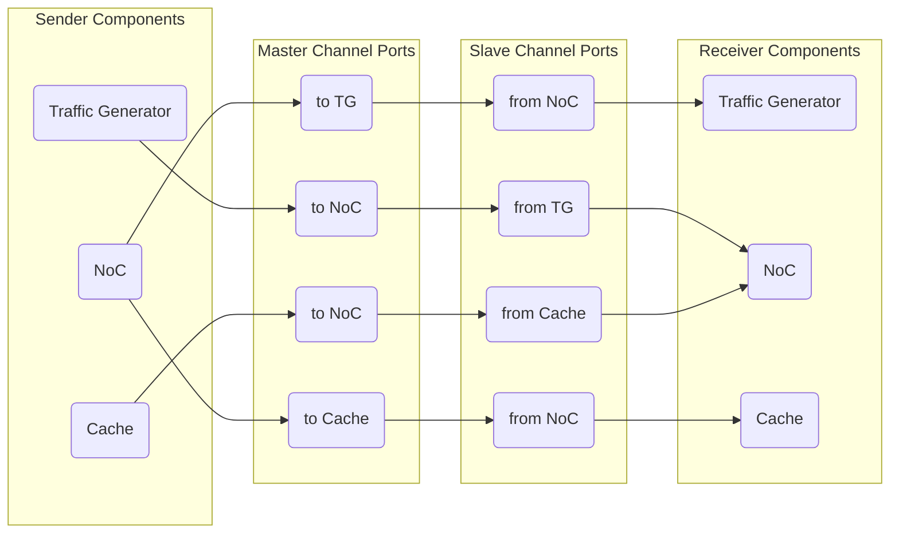

#  ACALSim User Guide - SimChannel

<!--
Copyright 2023-2025 Playlab/ACAL

Licensed under the Apache License, Version 2.0 (the "License");
you may not use this file except in compliance with the License.
You may obtain a copy of the License at

http://www.apache.org/licenses/LICENSE-2.0

Unless required by applicable law or agreed to in writing, software
distributed under the License is distributed on an "AS IS" BASIS,
WITHOUT WARRANTIES OR CONDITIONS OF ANY KIND, either express or implied.
See the License for the specific language governing permissions and
limitations under the License.
-->

[toc]

---

- Author: Yu-Yang Lee \<ppalee1217@gmail.com\>
- Date: 2025/03/11

([Back To Documentation Portal](/docs/README.md))

## Introduction

ACALSim is a simulation framework designed for building systems composed of multiple simulators, each potentially operating within separate software threads (`SimBase`). To facilitate safe and efficient inter-thread communication, ACALSim provides the `SimChannel`, a thread-safe software channel for transmitting `SimPacket` objects.

### Distinctions  Between `SimChannel` and `SimPort`

Although both `SimChannel` and `SimPort` support data transmission, they serve distinct roles:

- `SimPort` models actual hardware connections, including many-to-one port arbitration, and employs an output request queue at the slave side.

- `SimChannel` is a purely software-based mechanism designed for inter-thread communication. It enables the transmission of as many packets as possible simultaneously from the master to the slave at iteration boundaries, ensuring thread safety.

The ACALSim framework leverages `SimChannel` to handle data transmission across running threads and ensures thread safty.

### Functionality and Thread-Safety Mechanisms

`SimChannel` employs a **ping-pong queue mechanism**, with separate buffers for input (push) and output (pop) operations. At synchronization points, when all pending events and data transmissions for the current iteration are complete, the buffers are swapped to prevent race conditions.

When an output channel port has outgoing packets, ACALSim automatically invokes the user-defined virtual function `SimBase::accept()` to accpet them. By default, this function leverages the [visitor design pattern](https://codimd.playlab.tw/8tW0EXqZQz291CFHXT_vBg) to handle `SimPacket`s by calling `SimPacket::visit()` on each received packet.


### Usage Constraints of `SimChannel`
ACALSim does not limit the number of input or output channel ports per simulator. Simulators may operate without channels or employ multiple input and output channels according to their specific needs.

## The Design Philosophy
`SimChannel` is built on the following principles to support robust and efficient simulations in multithreaded environments:

### 1. Thread-Safe Data Communication
To avoid race conditions and inconsistent states, `SimChannel` isolates send and receive queues until the end of each cycle.

### 2. Cross-Thread Event Scheduling
Many simulations require synchronized scheduling and triggering of events across different components. `SimChannel` supports sending events (wrapped in `SimPacket`) to other threads safely, ensuring consistent event timing.

### 3. Deterministic Simulation Outcomes
A one-cycle delay is enforced for packet transfers between `SimBase` instances. This ensures all incoming packets for the current cycle are processed before expired events are handled, yielding predictable and repeatable results.

### 4. Abstract Latency Modeling
`SimChannel`'s built-in functionality allows developers to directly specify delays, ensuring accurate simulation of latencies while maintaining clear and concise simulator logic.

## QuickStart

### Create and connect `SimChannel` between `SimBase`s
To initialize and connect `SimChannel` ports between simulators, use the `SimTop::registerSimulators()` function. This function is called by the ACALSim framework within `SimTop`. Connections between the sending upstream and receiving downstream simulators are established using `ChannelPortManager<void*>::ConnectPort()`. The upstream and downstream simulators, along with their respective channel port names, must be provided.

```cpp
class testExample : public SimTop {
public:
	testExample() : SimTop(), LoggingObject("testExample") {}

	void registerSimulators() override {
		// Create simulators
		SimBase* simA = (SimBase*)new SimA("SimA");
                SimBase* simB = (SimBase*)new SimB("SimB");

               // Register Simulators
		this->addSimulator(simA);
		this->addSimulator(simB);

		// Connect SimChannels
		/* simA -> simB */
		ChannelPortManager<void*>::ConnectPort(simA, simB, "DSSimB", "USSimA");
		/* simB -> simA */
		ChannelPortManager<void*>::ConnectPort(simB, simA, "USSimA", "DSSimB");

		// Connect simulators
		simA->addDownStream(simB, "DSSimB");
		simB->addUpStream(simA, "USSimA");
	}
};
```

### Common Usages Pattern
`SimChannel` serves as a dedicated mechanism to ensure thread-safe and deterministic communication among concurrently executing threads in ACALSim. It is primarily used for two purposes:

- **Packet-Based Data Exchange**
`SimChannel` ensures safe transmission of `SimPacket` objects among different `SimBase` instances. While communication within a single `SimBase` is inherently safe, inter-`SimBase` exchanges risk race conditions. To mitigate these, `SimChannel` uses separate sender and receiver queues with a one-cycle delay.
When exchanging packets, users typically create a custom packet class derived from `SimPacket` that adheres to the visitor pattern. This approach triggers the receiver's appropriate handling function upon the packet's arrival.

- **Cross-Thread Event Scheduling**
`SimChannel` also facilitates future event scheduling across different `SimBase` instances by dispatching events as packets.
ACALSim provides an `EventPacket` class to encapsulate `SimEvent` objects. To schedule an event for another simulator, wrap the event in an `EventPacket` along with the intended schedule time, then push the packet through the appropriate `SimChannel`.
    ```cpp
    // Encapsulate the event within EventPacket,
    // specifying the event expire time at the receiver
    auto eventPkt = new EventPacket(event, schuedule_timing);
    ```

### Transmitting `SimPacket`s
Use `SimBase::sendPacketViaChannel()` to transmit packets between simulators. This function automatically models both local and remote delays, eliminating the need to manually create and schedule delay events. Detailed information on this modeling is provided in the [SimPacket Passing Between SimChannels](#SimPacket-Passing-Between-SimChannels) section.

The example below shows a packet send operation with delay parameters:
```cpp
#include "ReqPacket.hh"

void SimA::sendPacket() {
    // Create a packet that inherits from SimPacket
    auto pkt = new ReqPacket();

    // Setting local delay & remote delay
    Tick local_delay = ...;
    Tick remote_delay = ...;

    // Push the event packet to the SimChannel sender port
    this->sendPacketViaChannel("DSSimB", local_delay, remote_delay, (SimPacket*)pkt);
}
```

If latency modeling is not required in certain scenarios, use `ChannelPortManager::pushToMasterChannelPort()` instead. This function pushes the packet into the `SimChannel` during the current cycle, with the packet being processed by the receiver in the next cycle—equivalent to setting both local and remote delays to zero in `SimBase::sendPacketViaChannel()`.

```cpp
#include "ReqPacket.hh"

void SimA::sendPacket() {
    // Create a packet that inherits from SimPacket
    auto pkt = new ReqPacket();

    // Push the event packet to the SimChannel sender port
    this->pushToMasterChannelPort("DSSimB", (SimPacket*)pkt);
}
```

## Features
### `SimChannel`


The diagram above shows the `SimChannel` design, where a ping-pong queue is used to manage packet flow. Packets are pushed or popped according to the global `SimChannelGlobal::SimChannelStatus`:

- **`PONG_PUSH_PING_POP`**
  - Push packets into the **ping** queue.
  - Pop packets from the **pong** queue.

- **`PING_PUSH_PONG_POP`**
  - Push packets into the **pong** queue.
  - Pop packets from the **ping** queue.

This status toggles at the end of each iteration in ACALSim. An “iteration” corresponds to a specific simulation tick, during which events and data transmissions are processed.

During **phase 1** of each iteration, packets are pushed and popped from the ping-pong queue. In **phase 2**, ACALSim performs thread synchronization. At the end of phase 1, the ping-pong queues switch status. Thus, any packets pushed in phase 1 are only popped at the start of the next phase 1 by the receiving simulator. This design ensures correct timing of inter-simulator communication.

`SimChannel` is implemented using [cpp-channel](https://github.com/andreiavrammsd/cpp-channel) by Andrei Avram, a thread-safe container for sharing data among threads.

#### SimChannel APIs

```cpp
template <typename T>
bool SimChannel<T>::nonEmptyForPop();
```
- Returns `true` if there are items in the queue designated for popping, and `false` otherwise.

```cpp
template <typename TT>
friend SimChannel<typename std::decay<TT>::type>& operator<<(SimChannel<typename std::decay<TT>::type>& ch, const TT& in);
```
- Pushes data (`in`) into the channel's current push queue.

```cpp
template <typename TT>
friend SimChannel<TT>& operator>>(SimChannel<TT>& ch, TT& out);
```
- Pops data (`out`) from the channel's current pop queue.

```cpp
template <typename T>
msd::channel<T>* SimChannel<T>::getQueueForPush() {
    return (SimChannelGlobal::getChannelDualQueueStatus() == SimChannelStatus::PING_PUSH_PONG_POP)
        ? this->pingQueue
        : this->pongQueue;
}
```
- Returns the queue used for pushing packets, determined by the global `SimChannelStatus`.

```cpp
template <typename T>
msd::channel<T>* SimChannel<T>::getQueueForPop() {
    return (SimChannelGlobal::getChannelDualQueueStatus() == SimChannelStatus::PONG_PUSH_PING_POP)
        ? this->pingQueue
        : this->pongQueue;
}
```
- Returns the queue used for popping packets, determined by the global `SimChannelStatus`.

---

### `MasterChannelPort` & `SlaveChannelPort`

`ChannelPort` is the foundational class that connects a `SimChannel` to corresponding `ChannelPortManager` instances (e.g., `SimBase` or `SimTop`).

Both `MasterChannelPort` and `SlaveChannelPort` derive from `ChannelPort`:
- A `MasterChannelPort` **pushes** packets into the `SimChannel`.
- A `SlaveChannelPort` **pops** packets from the `SimChannel`.

By providing a simplified interface, these ports hide the internal ping-pong queue logic from the end user.

#### ChannelPort APIs

```cpp
ChannelPortManager* ChannelPort::getChannelMate() const;
```
- Returns the opposite simulator's `ChannelPortManager` that is connected to this port.

```cpp
std::shared_ptr<ChannelPort::TSimChannel> ChannelPort::getChannel() const;
```
- Returns the `SimChannel` object registered with this `ChannelPort`.

```cpp
void MasterChannelPort::push(const TPayload& item);
```
- Pushes a packet into the channel's push queue.
- Notifies the receiving simulator via `SimBase::handleInboundNotification()`, which sets a flag indicating inbound requests.

```cpp
ChannelPort::TPayload SlaveChannelPort::pop();
```
- Pops a packet from the channel's pop queue.

### `ChannelPortManager`

`ChannelPortManager` coordinates `MasterChannelPort` and `SlaveChannelPort` to facilitate packet transfers between simulators. By centralizing port registration and connections, it helps maintain organized data flow and synchronization. The `SimBase` class typically inherits from `ChannelPortManager`.

#### APIs in `ChannelPortManager` Class

1. **Channel Management**

```cpp
void ChannelPortManager::addSlaveChannelPort(std::string _name, SlaveChannelPort::SharedPtr _in_port);
void ChannelPortManager::addMasterChannelPort(std::string _name, MasterChannelPort::SharedPtr _out_port);
```
- Registers a slave or master port with a descriptive name.

```cpp
SlaveChannelPort::SharedPtr ChannelPortManager::getSlaveChannelPort(std::string _name) const;
MasterChannelPort::SharedPtr ChannelPortManager::getMasterChannelPort(std::string _name) const;
```
- Retrieves a slave or master port instance using its registered name.

```cpp
static inline void ConnectPort(ChannelPortManager* _sender,
                               ChannelPortManager* _receiver,
                               std::string _sender_port_name,
                               std::string _receiver_port_name);
```
- Connects a master port in one simulator to a slave port in another, defining the packet flow path.

2. **Packet Transmission**

```cpp
void ChannelPortManager::pushToMasterChannelPort(std::string _name, ChannelPortManager::TPayload const& _item);
```
- Sends a packet (`_item`) to the specified master channel port (`_name`). The packet will eventually be delivered to the connected slave channel port.

```cpp
ChannelPortManager::TPayload ChannelPortManager::popFromSlaveChannelPort(std::string _name);
```
- Retrieves a packet from the specified slave channel port (`_name`).

```cpp
void SimBase::sendPacketViaChannel(std::string dsChannelPortName, Tick localDelay, Tick remoteDelay, SimPacket* pkt);
```
- Sends a packet (`pkt`) to the master channel port that connects to a downstream simulator specified by `dsChannelPortName`.
- Let users model `localDelay` and `remoteDelay` for more accurate simulation of network latency.

:::info
**Note**:
- ACALSim **automatically** pops packets at the beginning of phase 1 in each iteration, delivering them to the receiving simulator. Therefore, users do not need to call `ChannelPortManager::popFromSlaveChannelPort()`.
- To push packets with latency modeling, use `SimBase::sendPacketViaChannel()`, which models both local and remote transmission latencies.
- To push packets without latency modeling, use `ChannelPortManager::pushToMasterChannelPort()` to ensure thread-safe packet transmission.
:::

3. **Pending Activity**

In ACALSim, pending activities ensure that all inbound requests are processed properly, even if the event queue is temporarily empty. Flags and checks manage these inbound requests effectively.

```cpp
bool SimBase::hasInboundChannelReq() const;
```
- Returns `true` if there are any pending inbound channel requests in the current iteration's phase 1.

```cpp
bool SimBase::hasInboundChannelReqLastIteration() const;
```
- Returns `true` if there were any unprocessed inbound requests at the end of the previous iteration.

```cpp
void SimBase::setInboundChannelReq(bool _flag = true);
```
- Sets a flag indicating that at least one new inbound request is pending.
- Typically called from `handleInboundNotification()`.

```cpp
void SimBase::setInboundChannelReqLastIteration(bool _flag);
```
- Marks that there were leftover inbound requests at the end of the previous iteration.

```cpp
void SimBase::handleInboundNotification();
```
- Invoked when a new packet arrives via an inbound channel.
- By default, it calls `setInboundChannelReq()`, signaling pending data to be processed.

## Single-Iteration Simulation Timeline


A single ACALSim iteration has two phases:

### Phase #1: Parallel Simulator Execution

All simulators run concurrently. Each simulator calls `SimBase::stepWrapperBase()`, which does the following:

1. Extracts all inbound channel requests.
2. Processes expired events from its event queue at the current cycle.
3. Invokes the user-defined `SimBase::step()` method.

By the end of phase 1, simulators may have pushed new requests into their `MasterChannelPort`s.

### Phase #2: Synchronization and Update

In this phase, all simulator threads pause. The control thread then:
1. Calls `SimBase::syncSimPort()` for synchronization.
2. Calls `SimBase::interIterationUpdate()` to finalize updates.

Within `SimBase::interIterationUpdate()`, the framework checks each simulator's channel or port status, including any pending inbound requests. It captures the **rising edge** when a simulator receives newly arrived (yet unprocessed) inbound requests and was not busy in the previous tick, and it detects the **falling edge** in the opposite scenario.

It then sets flags using `SimBase::setInboundChannelReqLastIteration()`, ensuring the simulator's active bitmask (`pSimulatorActiveBitMask`) is accurately updated in `SimTop`.

Finally, any inbound-pending flags are cleared by calling `setInboundChannelReq(false)`. If upstream simulators push more packets in a future tick, those flags will be raised again to reflect new inbound activity.

This two-phase approach ensures proper synchronization and consistent state among all simulators.

## `SimPacket` Passing Between `SimChannel`s

### `SimPacket` flow in `SimChannel`s


When a packet is pushed into a `SimChannel` via `SimBase::sendPacketViaChannel()`, the framework checks the specified local and remote delays. If a remote delay is non-zero, the packet is first wrapped in a `DelayEvent` and then encapsulated within a `ChannelEventPacket` (which itself is a `SimPacket`). If a local delay is non-zero, the packet (or its wrapped version) is enclosed in a `DelayEvent` and immediately scheduled into the sender simulator's event queue. Note that local and remote delay modeling are decoupled, so each will operate independently.

Once there is no local delay or the local `DelayEvent` expires, the function `ChannelPortManager::pushToMasterChannelPort()` is executed to deliver the packet to the master port.
```cpp
// acalsim/libs/sim/SimBase.cc

void SimBase::sendPacketViaChannel(std::string dsChannelPortName, Tick localDelay, Tick remoteDelay, SimPacket* pkt) {
    const auto rc = top->getRecycleContainer();

    Tick       now        = top->getGlobalTick();
    SimPacket* channelPkt = pkt;

    if (remoteDelay != 0) {
        auto downstreamEvent =
            rc->acquire<DelayEvent>(static_cast<void (DelayEvent::*)(SimPacket*)>(&DelayEvent::renew), pkt);
        channelPkt = rc->acquire<ChannelEventPacket>(&ChannelEventPacket::renew, downstreamEvent,
                                                     now + localDelay + 1 + remoteDelay);
    }

    if (localDelay == 0) {
        this->pushToMasterChannelPort(dsChannelPortName, channelPkt);
    } else {
        auto delayEvent = rc->acquire<DelayEvent>(
            static_cast<void (DelayEvent::*)(SimBase*, std::string, SimPacket*)>(&DelayEvent::renew), this,
            dsChannelPortName, channelPkt);
        this->scheduleEvent(delayEvent, now + localDelay);
    }
}
```

```cpp
// acalsim/libs/sim/SimBase.cc

void DelayEvent::process() {
    if (isChannelReq) {
        this->callee->pushToMasterChannelPort(dsChannelPortName, pkt);
    } else {
        this->callee->accept(acalsim::top->getGlobalTick(), (SimPacket&)*this->getPacket());
    }
}
```

During phase 2 of the current cycle, the packet is transferred from the sender's master channel port to the receiver's slave channel port. If a remote delay is applied, the packet becomes a `ChannelEventPacket`. Its visit function calls the packet handler and schedules the associated `DelayEvent` in the event queue. Once the `DelayEvent` expires, the receiver simulator processes the packet following the visitor design pattern.

```cpp
// acalsim/libs/sim/SimBase.cc

void ChannelEventPacket::visit(Tick when, SimBase& simulator) {
    if (auto delayEvent = dynamic_cast<DelayEvent*>(this->getEvent())) { delayEvent->setCallee(&simulator); }
    simulator.handler(when, this);
}
```

### Timeline of Simulator Interaction


1. A packet with `localDelay = 0` is immediately pushed into the `SimChannel` specified by `dsChannelPortName`. A non-zero `localDelay` triggers the scheduling of a `DelayEvent` in `SimA` to postpone the operation. **(N cycles)**
2. The packet arrives at `SimB` after a **one-cycle delay** from being pushed into the `SimChannel`.
3. A packet with `remoteDelay = 0` is immediately visited by `SimB`. Otherwise, a `DelayEvent` is scheduled in `SimB` to defer the visitation. **(`M` cycles)**
## Example - `src/testSimChannel`

In project `testSimChannel`, we demonstrate the usage of `SimChannel` between `SimBase`s.

### `SimChannel` Between `SimBase`s
In this example, we'll demonstrate how to establish connections between multiple `SimBase`s:
- `TrafficGenerator`:
    - Send request to "NoC".
    - Receive response from "NoC".
- `NoC`:
    - Receive request from "TrafficGenerator", and pass to "Cache".
    - Receive response from "Cache", and pass to "TrafficGenerator".
- `Cache`:
    - Recieve request from "NoC".
    - Send response to "NoC".

This example mainly demonstrates the simulation of packet transmission among `SimBase` instances via `SimChannel`. In this setup, `TrafficGenerator` and `Cache` simulate both local and remote latencies during packet transmission, while `NoC` performs thread-safe packet transfer without latency modeling, as latency has already been accounted for by the other components (i.e., remote delay in `TrafficGenerator` and `Cache`).
### Establishing Connections
The following steps illustrate how to set up the connections:


1. `Traffic Generator` and `Cache` each have one `MasterChannelPort` and one `SlaveChannelPort` connecting to `NoC`.
2. `NoC` has two `MasterChannelPort`s and two `SlaveChannelPort`s, with each pair connecting to either `Traffic Generator` or `Cache`.

Below, we'll walk through the process of creating and connecting `SimChannel` between components.
- `src/testSimChannel/testSimChannel.cc`
    ```cpp
    void TestSimChannel::registerSimulators() override {
        // Create simulators
        SimBase* trafficGenerator = (SimBase*)new TrafficGenerator("Traffic Generator");
        SimBase* nocSim           = (SimBase*)new NocSim("Noc Simulator");
        SimBase* cacheSim         = (SimBase*)new CacheSim("Cache Simulator");

        // Register simulators
        this->addSimulator(trafficGenerator);
        this->addSimulator(nocSim);
        this->addSimulator(cacheSim);

        std::string tg2noc_port    = "TG2NOC";
        std::string noc2cache_port = "NOC2Cache";
        std::string cache2noc_port = "Cache2NOC";
        std::string noc2tg_port    = "NOC2TG";

        // Connect components with SimChannel
        ChannelPortManager::ConnectPort(trafficGenerator, nocSim, tg2noc_port + "-m", tg2noc_port + "-s");
        ChannelPortManager::ConnectPort(nocSim, cacheSim, noc2cache_port + "-m", noc2cache_port + "-s");
        ChannelPortManager::ConnectPort(cacheSim, nocSim, cache2noc_port + "-m", cache2noc_port + "-s");
        ChannelPortManager::ConnectPort(nocSim, trafficGenerator, noc2tg_port + "-m", noc2tg_port + "-s");

        // Connect simulators
        trafficGenerator->addDownStream(nocSim, "DSNOC");
        nocSim->addDownStream(cacheSim, "DSCache");
        cacheSim->addUpStream(nocSim, "USNOC");
        nocSim->addUpStream(trafficGenerator, "USTrafficGenerator");
    }
    ```

### Push `SimPacket` into `SimChannel`
1. Specify local latency and remote latency when using `SimBase::sendPacketViaChannel()` to push a packet.
    - `src/testSimChannel/libs/TrafficGenerator.cc`
        ```cpp
        void TrafficGenerator::sendNoCRequest(int _tid) {
            // Create NocReqPacket
            int  _size     = 256;
            int  _addr     = 0;
            auto nocReqPkt = new NocReqPacket(NocPktTypeEnum::TEST, _addr, _size, _tid);

            // Setting remote & local delay
            auto local_delay  = _tid * 2 + 1;
            auto remote_delay = this->getRemoteDelay();

            // Send NocReqPacket to NoC
            this->sendPacketViaChannel("TG2NOC-m", local_delay, remote_delay, nocReqPkt);
        }
        ```
    - `src/testSimChannel/libs/CacheSim.cc`
        ```cpp
        void CacheSim::handleNOCRequest(CacheReqPacket* _cacheReqPkt, Tick _when) {
            // Create CacheRespPacket
            int* data         = new int(100 + (int)_when);
            auto cacheRespPkt = new CacheRespPacket(CachePktTypeEnum::TEST, data, _cacheReqPkt->getTransactionId());

            // Setting remote & local delay
            auto local_delay  = this->getRespDelay(_cacheReqPkt->getSize());
            auto remote_delay = 0;

            // Send CacheRespPacket to NoC
            this->sendPacketViaChannel("Cache2NOC-m", local_delay, remote_delay, cacheRespPkt);
        }
        ```
2. Use `ChannelPortManager::pushToMasterChannelPort()` to send a packet when no latency is required.
    - `src/testSimChannel/libs/NoCSim.cc`
        ```cpp
        void NocSim::handleTGRequest(NocReqPacket* _nocReqPkt) {
            // Add NocReqPacket to ReqQueue
            reqQueue->add(id, (SimPacket*)_nocReqPkt);
            // Create CacheReqPacket
            auto id          = _nocReqPkt->getTransactionId();
            auto cacheReqPkt = new CacheReqPacket(CachePktTypeEnum::TEST, _nocReqPkt->getAddr(), _nocReqPkt->getSize(), id);

            // Send CacheReqPacket to Cache
            this->pushToMasterChannelPort("NOC2Cache-m", (SimPacket*)cacheReqPkt);
        }
        ```
        ```cpp
        void NocSim::handleCacheRespond(CacheRespPacket* _cacheRespPkt) {
            if (auto reqPkt = ((NocReqPacket*)reqQueue->get(id))) {
                // Create NocRespPacket
                auto id            = _cacheRespPkt->getTransactionId();
                auto nocRespPacket = new NocRespPacket(NocPktTypeEnum::TEST, _cacheRespPkt->getData(), id);

                // Send NocRespPacket to Traffic Generator
                CLASS_INFO << "NocSim sendPacketViaChannel with local latency = " << 0 << ", remote latency = " << 0;
                this->pushToMasterChannelPort("NOC2TG-m", (SimPacket*)nocRespPacket);
            }
        }
        ```

### Following the Visitor Pattern to Accept Popped `SimPacket`
`SimChannel` manages transmissions by passing packets, so the entire process follows the visitor pattern: each receiver implements a visit function to handle incoming packets. For a detailed explanation of this pattern, see [ACALSim User Guide - Packet-Based Communication and Visitor Design Pattern](https://codimd.playlab.tw/8tW0EXqZQz291CFHXT_vBg).

As mentioned earlier, the process of popping `SimPacket`s from `SimChannel` is handled by the ACALSim framework. Users only need to implement the visit function for each transferred packet, defining how the receiver handles it.

- Visit function for `Traffic Generator` → `NoC`
    - `src/testSimChannel/libs/NocPacket.cc`
    ```cpp
    void NocReqPacket::visit(Tick when, SimBase& simulator) {
        if (dynamic_cast<NocSim*>((SimBase*)(&simulator))) {
            dynamic_cast<NocSim*>((SimBase*)(&simulator))->handleTGRequest(this);
        }
    }
    ```
- Visit function for `NoC` → `Cache`.
    - `src/testSimChannel/libs/CachePacket.cc`
    ```cpp
    void CacheReqPacket::visit(Tick when, SimBase& simulator) {
        if (dynamic_cast<CacheSim*>((SimBase*)(&simulator))) {
            dynamic_cast<CacheSim*>((SimBase*)(&simulator))->handleNOCRequest(this, when);
        }
    }
    ```
- Visit function for `Cache` → `NoC`.
    - `src/testSimChannel/libs/CachePacket.cc`
    ```cpp
    void CacheRespPacket::visit(Tick when, SimBase& simulator) {
        if (dynamic_cast<NocSim*>((SimBase*)(&simulator))) {
            dynamic_cast<NocSim*>((SimBase*)(&simulator))->handleCacheRespond(this);
        }
    }
    ```
- Visit function for `NoC` → `Traffic Generator`.
    - `src/testSimChannel/libs/NocPacket.cc`
    ```cpp
    void NocRespPacket::visit(Tick when, SimBase& simulator) {
        if (dynamic_cast<TrafficGenerator*>((SimBase*)(&simulator))) {
            dynamic_cast<TrafficGenerator*>((SimBase*)(&simulator))->handleNoCRespond(this);
        }
    }
    ```
