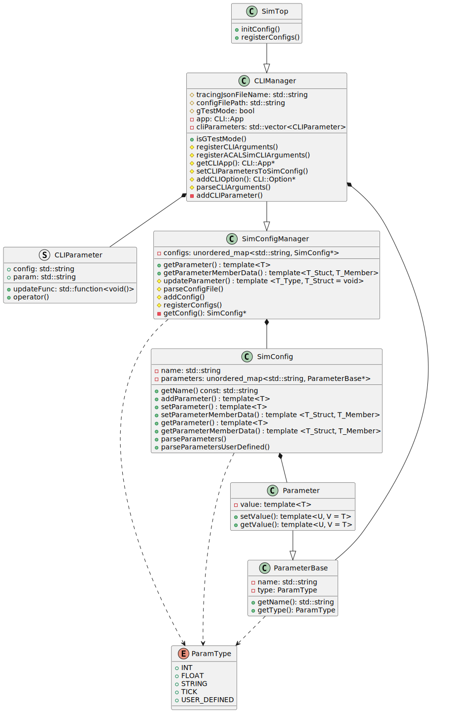

# SimConfig and CLI - ACALSim User Guide

<!--
Copyright 2023-2025 Playlab/ACAL

Licensed under the Apache License, Version 2.0 (the "License");
you may not use this file except in compliance with the License.
You may obtain a copy of the License at

http://www.apache.org/licenses/LICENSE-2.0

Unless required by applicable law or agreed to in writing, software
distributed under the License is distributed on an "AS IS" BASIS,
WITHOUT WARRANTIES OR CONDITIONS OF ANY KIND, either express or implied.
See the License for the specific language governing permissions and
limitations under the License.
-->


---

- Author: Chieh-Chih Lin \<frank891021@gmail.com\>, Yen-Po Chen \<yenpo@twhpcedu.org\>
- Date: 2024/12/06

([Back To Documentation Portal](/docs/README.md))

## Introduction to ACALSim Configuration Management

ACALSim provides a robust framework for defining and managing simulation configuration parameters through various interfaces. This document outlines the integration of the CLI11 library with ACALSim, facilitating efficient parameter management via command-line arguments and JSON configuration files.

### The `SimConfig` Class

At the core of ACALSim's configuration management is the `SimConfig`  class. This versatile component supports various types of parameters, including integers, floats, strings, ticks, and user-defined structures. Key features include:

- **Parameter Registration**
    - Define parameters with default values and associated metadata
    - Organize parameters into logical groups for structured access

- **Consistent Access**
    - Ensure uniform parameter retrieval throughout the simulation lifecycle

### CLI Integration

The integration with `CLI11` enhances `SimConfig` by allowing parameter management through command-line arguments:

- **Runtime Flexibility**
    - Override parameters using the syntax `--<option-name>` value
    - CLI parameters take highest priority, enabling immediate adjustments

- **User-Friendly Interface**
    - Intuitive command-line syntax for specifying or modifying parameters


### JSON Integration

`SimConfig` also supports initialization from JSON configuration files:

- **Structured Definitions**
    - Utilize JSON's hierarchical format for complex parameter configurations

- **File-Based Configuration**
    - Read parameter values from a single JSON file per execution

### Parameter Priority Hierarchy

ACALSim has a strict priority system for parameter values, organized as follows:

1. **Command-Line Interface (CLI)**: Highest priority
2. **JSON Configuration File**: Medium priority
3. **SimConfig Default Values**: Lowest priority

This hierarchy ensures optimal flexibility, allowing dynamic parameter adjustments while maintaining predefined configurations.

### Framework Limitations
While ACALSim supports multiple `SimConfig instances`, it is limited to reading a single JSON file per execution.

## UML Class Diagram



## QuickStart

The following steps outline the minimum requirements for using `SimConfig` to manage and access hardware configuration parameters:

### 1. Creating `SimConfig` for your simulation

1. Define a User-Defined Config class that inherits from `SimConfig` and register parameters with default values:

- All `ParamType` values (`INT`, `FLOAT`, `STRING`, `TICK`, `USER_DEFINED`) can be registered in the same manner.

    ``` cpp
    class XXXConfig : public SimConfig {
    public:
        XXXConfig(const std::string& _name) : SimConfig(_name) {
            // Add Parameter in SimConfig via SimConfig::addParameter()
            this->addParameter<data_type>("<param_name>", 0, <ParamType enum class>);
        }

        ~XXXConfig() {}

        // Parse User Defined Parameter (ParamType::USER_DEFINED)
        void parseParametersUserDefined(const std::string& _param_name, const json& _param_value) override {}
    };
    ```

2. Add `XXXConfig` to ACALSim Frameworks at `SimTop`:

    ``` cpp
    class XXXTop : public SimTop {
    public:
        void registerConfigs() override {
            // 1. instantiate "TestConfig" in constructor of simulator.
            auto config = new XXXConfig("Test configuration");

            // 2. add "TestConfig" into configContainer.
            this->addConfig("<config_name>", config);
        }
    };
    ```

### 2. Overwriting Default Parameter Values via JSON Config File

All `SimConfig` instances share a single JSON configuration, rather than each `SimConfig` having its own JSON configuration.

Create a JSON file in the following format:
- Example
    ``` json
    {
        "<config_name>": {
            "<param_name>": 1
        }
	}
    ```
- In later section, we will show a three-level configuration with user-defined parameter class

### 3. Overwriting Default Parameter Values via CLI Arguments
``` cpp
class XXXTop : public SimTop {
public:
    // Add CLI Option into CLI Application.
    void registerCLIArguments() override {
        // This method will add option into CLI11 Application and
        //
        // the value of parameter is scalar type
        this->addCLIOption<data-type>("--<option_name>", "<option_description>",
                                "<config_name>", "<param_name>");

        // the value is member data of struct in parameter
        // [Notice] <struct-type> is specified at second template type.
        this->addCLIOption<<data-type>, <struct-type>>("--<option_name>", "<option_description>",
                                        "<config_name>", "<param_name>", "<member_name>");
    }
};
```

### 4. Retrieving Parameter Values

To obtain a parameter value, specify the config object name, parameter name, and data type:

- Example:
    ``` cpp
    auto t = acalsim::top->getParameter<data_type>("<config_name>", "<param_name>");
    ```
For accessing member data of a struct-type parameter:

- Example:
    ``` cpp
    auto t = acalsim::top->getParameterMemberData<struct_type, data_type>("<config_name>", "<param_name>", "<member_name>");
    ```

### 5. Executing the Application with CLI and Config File

The priority order is: CLI > Configuration File > SimConfig Default Value

```shell
## use SimConfig default value
$ ./app_exe
## parameter will be updated by config file.
$ ./app_exe --config <path/to/configs.json>
## parameter will be updated by CLI arguments
$ ./app_exe --config <path/to/configs.json>  --<option_name> 20
```

## Features and User API

### 1. API in the `SimConfig` Class

``` cpp
template <typename T>
void SimConfig::addParameter(const std::string& _name, const T& _value, ParamType _type);
```
This method registers a parameter with name, value, and type into a specified `SimConfig` object.

- `T`: The data type of the value that the Parameter object contains.
- `name`: The name of the parameter.
- `value`: The default value of the parameter.
- `type`: The type of parameter, including `INT`, `FLOAT`, `STRING`, `TICK`, `USER_DEFINED`.

Example usage:

``` cpp
this->addParameter<int>("<param_name>", 5, ParamType::INT);
```

### 2. APIs in the `SimTop` Class

`SimTop` inherits from the `SimConfigManager` class, allowing users to access the `SimConfigManager` interface through the `SimTop` class.

<hr>

``` cpp
void SimTop::addConfig(const std::string& _name, SimConfig* _config);
```
This method adds a `SimConfig object` to `SimConfigManager`.

- `name`: The name of the SimConfig.
- `config`: A pointer to the SimConfig object.

Example usage:

```cpp
this->addConfig("config_name", config_ptr);
```
Note: Invoke this method within the `SimTop::registerConfigs()` function to register the `SimConfig` into `SimConfigManager`.

<hr>

``` cpp
template <typename T>
T SimTop::getParameter(const std::string& _config_name, const std::string& _param_name) const;
```
This method retrieves the value of a Parameter object.

- `T`: The data type of the value.
- `config_name`: The name of the `SimConfig` object.
- `param_name`: The name of the `Parameter` object.

Example usage:

``` cpp
top->getParameter<data_type>("<config_name>", "<param_name>");
```

<hr>

``` cpp
template <typename T, typename U>
U SimTop::getParameterMemberData(const std::string& _configName,
                                 const std::string& _paramName,
                                 const std::string& _memberData) const;
```

This method retrieves the value of a member data of a struct in a Parameter object.

- `T`: The data type of the struct.
- `U`: The data type of the member data.
- `configName`: The name of the `SimConfig` object.
- `paramName`: The name of the Parameter object.
- `memberData`: The name of the member data in the struct.

Example usage:

``` cpp
top->getParameterMemberData<struct-type,data-type>("<config_name>", "<param_name>", "<member_name>");
```

<hr>

### 3. JSON File Structure

#### A. Three-Level Configuration

The configuration parameters are structured within curly braces `{}` and organized into three hierarchical levels:

#### a. Configuration Name

- **<config_name>**: Represents the name of the configuration, serving as a unique identifier for a specific setup.

#### b. Parameter Details

- **type**: Specifies the type of the data structure (e.g., a custom class or predefined data structure).
- **<param_name>**: Denotes the name of a parameter within the given configuration. Each parameter can hold different types of data and structures. There are two main types of parameter details:

    - Primitive Parameter Types: The parameter can directly hold primitive data types such as int, string, or float.
    - Complex Data Structures: Represents a user-defined tag or key that groups related data fields together. This can contain multiple fields.


#### c. Sub-Parameter Details (user-defined class only)

- **<data_name>**: Denotes the name of a specific data field within the user-defined tag.

These data fields can be primitive types (int, string, float), but no further nesting beyond this third level is allowed.

#### B. Example: `config.json`

``` json
{
  "<config_name>": { 					// 1st-Level
    "<param_name>": <int/string/float>, // 2nd-Level
    "<param_name>": {
      "type" : "<DataStruct>", 			// 3rd-Level
      "<user_defined_tag>" : {
        "<data_name>": <int/string/float>
      }
    }
  }
}
```
This structure provides a clear and organized way to define configuration parameters, allowing for both simple primitive types and more complex nested structures. The three-level hierarchy ensures that configurations can be detailed and specific while maintaining a manageable and readable format.
> **NOTICE**
> In the ACALSim project, the <user_defined_tag> should consistently use "param" as the convention. However, it is not mandatory for users to adhere to this convention as long as the <user_defined_tag> used in the Parser and the JSON file remain consistent.

#### C. User-Defined Parameters

For parsing user-defined parameters in the JSON file, developers are required to override the `SimTop::parseParametersUserDefined()` method. While the implementation is flexible, we recommend adhering to the following template to ensure consistency and ease of use:

##### Step #1 Parse from json file
###### a. Struct Type
To parse struct types, define `from_json(...)` method that enable parser `get<your_type>()` method. Make sure that

1. `void from_json(...)` is defined in the same namespace as user-defined data type.
2. user-defined parameter is default constructible.

``` cpp
inline void from_json(const json& j, <Class>& c) {
    j.at("data_name").get_to(c.data_name);
}
```
> **INFO**
> check [nlohmann/json : Basic usage](https://github.com/nlohmann/json?tab=readme-ov-file#basic-usage) for more details.


###### b. Enum Type

To parse enum types, define the macro `NLOHMANN_JSON_SERIALIZE_ENUM()` to specify the mapping between enum values and their JSON representations.

1. This macro is similar to `void from_json(...)` method but specifically for enum type.

``` cpp
NLOHMANN_JSON_SERIALIZE_ENUM(YourEnum, {
    {YourEnum::Value1, "value1"},
    {YourEnum::Value2, "value2"}
})

NLOHMANN_JSON_SERIALIZE_ENUM(YourEnum, {
    {YourEnum::Value1, 1},
    {YourEnum::Value2, 2}
})
```
> **Reference:**
> check [nlohmann/json : Specializing enum conversion](https://github.com/nlohmann/json?tab=readme-ov-file#specializing-enum-conversion) for more details.


##### Step #2 Store to SimConfig

Implement the `SimConfig::parseParametersUserDefined()` method to invoke the appropriate data type parser based on the parameter's type.

``` cpp
void parseParametersUserDefined(const std::string& _param_name, const json& _param_value) override {
    std::string data_type;
    _param_value.at("type").get_to(data_type);

    if (data_type == "<enum_class_name>") {
        auto r = _param_value.at("<user_defined_tag>").get<XXXEnum>();
        this->setParameter<XXXEnum>(_param_name, r);
    } else {
        CLASS_ERROR << "Undefined ParamType in parseParameterUserDefine()!";
    }
}
```

### 4. CLI Application
CLI11 is a C++ library for creating sophisticated command-line interfaces. This section outlines the integration of CLI11 with ACALSim to manage configuration parameters through command-line arguments.

#### Accessing `CLI::App` Instance

``` cpp
CLI:App* getCLIApp() { return &app; }
```

- User can interact with the CLI::App instance to manage command-line arguments and options. This instance provides methods to define and configure command-line options and arguments.
    > **Reference**
    > For more detailed information about the CLI11 library and its API, refer to the CLI11 [GitBook](https://cliutils.github.io/CLI11/book/).


#### ACALSim Provided Method
Add a CLI option and update the `SimConfig` Parameter.

``` cpp
template <typename T>
CLI::Option* addCLIOption(const std::string& _optionName, const std::string& _optionDescription,
                        const std::string& _configName, const std::string& _paramName,
                        const std::string& _memberName = "", const bool& _defaultValue = true);
```

- Invoke the `SimTop::addCLIOption()` method within the `SimTop::registerCLIArguments()` function to register CLI arguments with the CLI application. The method returns a pointer to a CLI::Option that you can further configure if needed.

    1. `_optionName` : The name of the option as it should appear on the command line (e.g., "--myoption").
    2. `_optionDescription` : A description of the option, which will be displayed in the help message.
    3. `_configName` : The name of the configuration from which to retrieve the default parameter value.
    4. `_paramName` : The name of the parameter being configured.
    5. `_memberName` : The name of the member data of struct in parameter being configured.
    6. `_defaultValue` : The default value for the option (default is `true`).

- Usage:
    ``` cpp
    void TestConfigTop::registerCLIArguments() {
        // for the value of parameter containing scalar type.
	    this->addCLIOption<data-type>(<"option_name">, <"option_description">, <"config_name">, <"param_name">, "", True);
        // for the value of member data of struct in parameter.
        // [notice] make sure the data-type at first place and struct-type at second place.
        this->addCLIOption<data-type, struct-type>(<"option_name">, <"option_description">, <"config_name">, <"param_name">, <"member_name">, True);
	}
    ```

    > **INFO**
    > Refer to the CLI11 [GitBook : Options](https://cliutils.github.io/CLI11/book/chapters/options.html) for more detailed information about the CLI11 library and its API.

## Example : `src/testConfig`

The following sections outline the minimum requirements for utilizing `SimConfig` to manage and access hardware configuration parameters. For illustrative purposes, we will take testConfig as example, which is available within ACALSim applications.

### 1. Create SimConfig
- override the `SimTop::registerConfigs()` and add user-defined config into framework.

- Example: `src/testConfig/include/TestConfigTop.hh`
    ``` cpp title="src/testConfig/include/TestConfigTop.hh"
    class TestConfigTop : public SimTop {
    public:
        void registerConfigs() override {
            // 1. Instantiate "TestConfig" in the constructor of the simulator.
            auto config = new TestConfig("Test configuration");
            // 2. Add "TestConfig" into container.
            this->addConfig("TestConfig", config);
        }
    };
    ```

### 2. Add Parameter

#### INT, FLOAT, STRING, TICK
1. To add parameters into class `TestConfig`

    ``` cpp title="src/testConfig/include/TestConfig.hh"
    class TestConfig : public SimConfig {
    public:
        TestConfig(const std::string& _name) : SimConfig(_name), LoggingObject(_name) {
            this->addParameter<int>("test_int", -1, ParamType::INT);
            this->addParameter<float>("test_float", -1.0, ParamType::FLOAT);
            this->addParameter<std::string>("test_string", "This is not TestConfig", ParamType::STRING);
            this->addParameter<Tick>("test_tick", 1, ParamType::TICK);
        }

        ~TestConfig() {}
    }
    ```

2. [Optional] To overwrite default value of parameters via json file

    - Follow the json file format and `SimConfig` naming convention.
        ``` json
        {
            "<Config_mame>": {
                "<parameter_name>": <int/float/string>
            }
        }
        ```
    - Example:
        ``` json title="src/testConfig/configs.json"
        {
            "TestConfig": {
                "test_int": 1,
                "test_float": 1.0,
                "test_string": "This is TestConfig",
                "test_tick": 1
            }
        }
        ```
3. [Optional] To overwrite the value of parameters in `SimConfig` objects by CLI Application in `SimTop`

    - Override the `void SimTop::registerCLIArguments()` method in which the user should add user-defined option into CLI application by `void SimTop::addCLIOption(...)` method.

        ``` cpp title="src/testConfig/include/TestConfigTop.hh"
        class TestConfigTop : public SimTop {
        public:
            void registerCLIArguments() override {
                // Framework will add option into CLI Application
                // and update the parameter in SimConfig
                this->addCLIOption<int>("--test_int", "Test Int Discription", "TestConfig", "test_int", ParamType::INT);
                this->addCLIOption<float>("--test_float", "Test Float Discription", "TestConfig", "test_float", ParamType::FLOAT);
                this->addCLIOption<std::string>("--test_string", "Test String Discription", "TestConfig", "test_string", ParamType::STRING);
                this->addCLIOption<Tick>("--test_tick", "Test Tick Discription", "TestConfig", "test_tick", ParamType::Tick);
            }
        }
        ```

#### USER_DEFINED : Enum Class
1. To add parameters into class `TestConfig`

    - Create enum class
    - Define MACRO `NLOHMANN_JSON_SERIALIZE_ENUM()` for parsing json file.
    - Define `map<string, enum>` for mapping between `string` and `xxxEnum` when parsing CLI Arguments.
    - Add parameter with `<data-type>` in `SimConfig` Constructor.
        ``` cpp title="src/testConfig/include/TestConfig.hh"
        /**** Step#1 : user-defined enum class ****/
        enum class TestIntEnum { INVALID = 0, I_V1, I_V2, I_V3};
        enum class TestStrEnum { INVALID = 0, S_V1, S_V2, S_V3};

        /**** Step#2 : for framework to parse from json file ****/
        // int in json file
        NLOHMANN_JSON_SERIALIZE_ENUM(TestIntEnum, {
            {TestIntEnum::INVALID, nullptr},
            {TestIntEnum::I_V1, 1},
            {TestIntEnum::I_V2, 2},
            {TestIntEnum::I_V3, 3},
        })

        // string in json file
        NLOHMANN_JSON_SERIALIZE_ENUM(TestStrEnum, {
            {TestStrEnum::INVALID, nullptr},
            {TestStrEnum::S_V1, "1"},
            {TestStrEnum::S_V2, "2"},
            {TestStrEnum::S_V3, "3"},
        })

        /**** Step#3 : for framework to parse from CLI.  ****/
        extern std::map<std::string, TestIntEnum> TestIntEnumMap;
        extern std::map<std::string, TestStrEnum> TestStrEnumMap;

        // [OPTION] for framework to print the parameter.
        extern std::map<TestIntEnum, std::string> TestIntEnumReMap;
        extern std::map<TestStrEnum, std::string> TestStrEnumReMap;


        class TestConfig : public SimConfig {
        public:
            TestConfig(const std::string& _name) : SimConfig(_name), LoggingObject(_name) {
                /**** Step#4 : add Parameter into SimConfig.  ****/
                this->addParameter<TestIntEnum>("test_int_enum", TestIntEnum::INVALID, ParamType::USER_DEFINED);
                this->addParameter<TestStrEnum>("test_str_enum", TestStrEnum::INVALID, ParamType::USER_DEFINED);
            }
        };
        ```
2. To parse json file containing user-defined enum class type.
    - Override the `void parseParametersUserDefined()` method in your SimConfig subclass. This method allows you to handle custom data types and integrate them into your simulation configuration.

    - Within the `parseParametersUserDefined()` method, add a conditional block for each user-defined enum class:
    ``` cpp
    if (data_type == "<enum_class_name>") {
        auto r = _param_value.at("<user_defined_tag>").get<XXXEnum>();
        this->setParameter<XXXEnum>(_param_name, r);
    }
    ```
    - There are no strict constraints on the implementation of `parseParametersUserDefined()`. However, we provide a template for ease of use:
    ``` cpp title="src/testConfig/include/TestConfig.hh"
    class TestConfig : public SimConfig {
    public:

        void parseParametersUserDefined(const std::string& _param_name, const json& _param_value) override {
            std::string data_type;
            _param_value.at("type").get_to(data_type);

            /**** Step#6 :  Add user define "data_type" and it "parameter_name". ****/
            if (data_type == "TestIntEnum") {
                auto r = _param_value.at("params").get<TestIntEnum>();
                this->setParameter<TestIntEnum>(_param_name, r);
            } else if (data_type == "TestStrEnum") {
                auto r = _param_value.at("params").get<TestStrEnum>();
                this->setParameter<TestStrEnum>(_param_name, r);
            } else {
                CLASS_ERROR("Undefined ParamType in parseParameterUserDefine()!");
            }
        }
    };
    ```
    - This implementation demonstrates how to handle multiple user-defined enum types within the parseParametersUserDefined() method. Adapt this template to your specific enum classes and parameter names as needed.

3. [Optional] To overwrite default value of parameters with json file.
    - Follow the json file format and `SimConfig` naming convention.
        ``` json
        {
            "<Config_mame>": {
                "<param_name>": {
                    "type" : "<enum_class_name>",
                    "<user_defined_tag>": <int/string>
                }
            }
        }
        ```
    - Example: src/testConfig/configs.json
        ``` json title="src/testConfig/configs.json"
        {
            "TestConfig": {
                "test_int_enum": {
                "type": "TestIntEnum",
                "params": 3
                },
                "test_str_enum": {
                "type": "TestStrEnum",
                "params": "3"
                }
            }
        }
        ```

4. [Optional] To overwrite the value of parameters in `SimConfig` objects by CLI application in SimTop.
    - Override the `void registerCLIArguments()` where user should add user-defined option into CLI application by `CLI::Option* SimTop::addCLIOption(...)` method followed by `CLI::Option* CLI::Option::transform()` to obtain the enum class type from string.
        ``` cpp title="src/testConfig/include/TestConfigTop.hh"
        class TestConfigTop : public SimTop {
        public:
            void registerCLIArguments() override {
                // Framework will add option into CLI Application
                // and update the parameter in SimConfig

                // Method 1 : store the returned CLI::Option pointer and invoke transform() by it.
                CLI::Option* option = this->addCLIOption<TestIntEnum>("--test_int_enum", "Test Int Enum Option Discription", "TestConfig", "test_int_enum", ParamType::USER_DEFINED);
                option->transform(CLI::CheckedTransformer(TestIntEnumMap, CLI::ignore_case));

                // Method 2 : invoke transform() right after addCLIOption().
                this->addCLIOption<TestStrEnum>("--test_str_enum", "Test Str Enum Option Discription", "TestConfig", "test_str_enum", ParamType::USER_DEFINED)->transform(CLI::CheckedTransformer(TestStrEnumMap, CLI::ignore_case));
            }
        }
        ```

#### USER_DEFINED : Data Struct

1. Add parameters into class `TestConfig`

    - Create data struct which have default constructor.
    - Define `void from_json(...)` method for parsing json object.
    - Specialize the template function `setValue()`/`getValue()` for user to set/get member data of Parameters containing struct-type data by using
        ```cpp
        SPECIALIZE_PARAMETER(ParamterStructType, Type, MAKE_MEMBER_PAIR(ParamterStructType, Member))
         ```
    - add parameter into TestConfig via method `addParameter<struct-type>("<param_name>", <instance-of-struct>, <ParamType>)`

    - Example:
        ``` cpp title="src/testConfig/include/TestConfig.hh"
        /**** Step#1 : user-defined data struct ****/
        struct TestStruct {
            int         test_struct_int;
            float       test_struct_float;
            std::string test_struct_string;
            Tick        test_struct_tick;
            TestIntEnum test_struct_int_enum;
            TestStrEnum test_struct_str_enum;

            // default constructor
            TestStruct()
                : test_struct_int(-1),
                test_struct_float(-1.0),
                test_struct_string("This is not TestStruct"),
                test_struct_tick(-1),
                test_struct_int_enum(TestIntEnum::INVALID),
                test_struct_str_enum(TestStrEnum::INVALID) {}
        };

        /**** Step#2 : for framework to parse from json file ****/
        inline void from_json(const json& j, TestStruct& b) {
            j.at("test_struct_int").get_to(b.test_struct_int);
            j.at("test_struct_float").get_to(b.test_struct_float);
            j.at("test_struct_string").get_to(b.test_struct_string);
            j.at("test_struct_tick").get_to(b.test_struct_tick);
            j.at("test_struct_int_enum").get_to(b.test_struct_int_enum);
            j.at("test_struct_str_enum").get_to(b.test_struct_str_enum);
        }

        // /**** Step#3 : template specialization for TestStruct ****/
        SPECIALIZE_PARAMETER(TestStruct, int, MAKE_MEMBER_PAIR(ParamterStructType, test_struct_int))
        SPECIALIZE_PARAMETER(TestStruct, float, MAKE_MEMBER_PAIR(ParamterStructType, test_struct_float))
        SPECIALIZE_PARAMETER(TestStruct, std::string, MAKE_MEMBER_PAIR(ParamterStructType, test_struct_string))
        SPECIALIZE_PARAMETER(TestStruct, Tick, MAKE_MEMBER_PAIR(ParamterStructType, test_struct_tick))
        SPECIALIZE_PARAMETER(TestStruct, TestIntEnum, MAKE_MEMBER_PAIR(ParamterStructType, test_struct_int_enum))
        SPECIALIZE_PARAMETER(TestStruct, TestStrEnum, MAKE_MEMBER_PAIR(ParamterStructType, test_struct_str_enum))


        class TestConfig : public SimConfig {
        public:
            /**** Step#4 : add Parameter into SimConfig.  ****/
            TestConfig(const std::string& _name) : SimConfig(_name), LoggingObject(_name) {
                this->addParameter<TestStruct>("test_struct", TestStruct(), ParamType::USER_DEFINED);
            }
        };
        ```

2. Override the `SimConfig::parseParametersUserDefined()` for `TestConfig` to parse user-defined data struct.
    - Override the `void parseParametersUserDefined()` method in your `SimConfig` subclass. This method allows you to handle custom data types and integrate them into your simulation configuration.

    - Within the `parseParametersUserDefined()` method, add a conditional block for each user-defined struct class:
        ``` cpp
        if (data_type == "<data_struct_name>") {
            auto r = _param_value.at("<user_defined_tag>").get<XXXStruct>();
            this->setParameter<XXXStruct>(_param_name, r);
        }
        ```
    - There are no strict constraints on the implementation of `parseParametersUserDefined()`. However, we provide a template for ease of use :
        ``` cpp title="src/testConfig/include/TestConfig.hh"
        class TestConfig : public SimConfig {
        public:
            void parseParametersUserDefined(const std::string& _param_name, const json& _param_value) override {
                std::string data_type;
                _param_value.at("type").get_to(data_type);

                if (data_type == "TestStruct") {
                    auto r = _param_value.at("params").get<TestStruct>();
                    this->setParameter<TestStruct>(_param_name, r);
                }
            }
        };
        ```

3. [Optional] To overwrite default value of parameters via json file

    - Follow the json file format and `SimConfig` naming convention.
        ``` json
        {
            "<config_mame>": {
                "<param_name>": {
                    "type" : "<enum_class_name>",
                    "<user_defined_tag>": {
                        "data_name": <int/float/string>
                    }
                }
            }
        }
        ```
    - Example : src/testConfig/configs.json
        ``` json
        {
            "TestConfig": {
                "test_struct": {
                "type": "TestStruct",
                "params": {
                    "test_struct_int": 1,
                    "test_struct_float": 1.0,
                    "test_struct_string": "This is TestStruct",
                    "test_struct_tick": 1,
                    "test_struct_int_enum": 1,
                    "test_struct_str_enum": "1"
                }
                },
            }
        }
        ```

### 3. Create main function
``` cpp
#include "ACALSim.hh"
using namespace acalsim;
#include "TestConfigTop.hh"

int main(int argc, char** argv) {
    top = std::make_shared<TestConfigTop>("SimTop.TestConfig");
    top->init(argc, argv);
    top->run();
    top->finish();
    return 0;
}
```

### 4. Compile and execute

#### [3rd priority] default value in `SimConfig`

``` shell
$ cd <path/to/acalsim>
$ make debug TARGET=testConfig ACALSIM_VERBOSE=1
$ ./build/debug/testConfig
```

#### [2nd priority] update the parameter in json file

``` shell
$ cd <path/to/acalsim>
$ make debug TARGET=testConfig ACALSIM_VERBOSE=1
$ ./build/debug/testConfig --config ./src/testConfig/configs.json
```

#### [1st priority] update the parameter by CLI

``` shell
$ cd <path/to/acalsim>
$ make debug TARGET=testConfig ACALSIM_VERBOSE=1
$ ./build/debug/testConfig --config ./src/testConfig/configs.json --test_int 10 --test_int_enum 1
```
