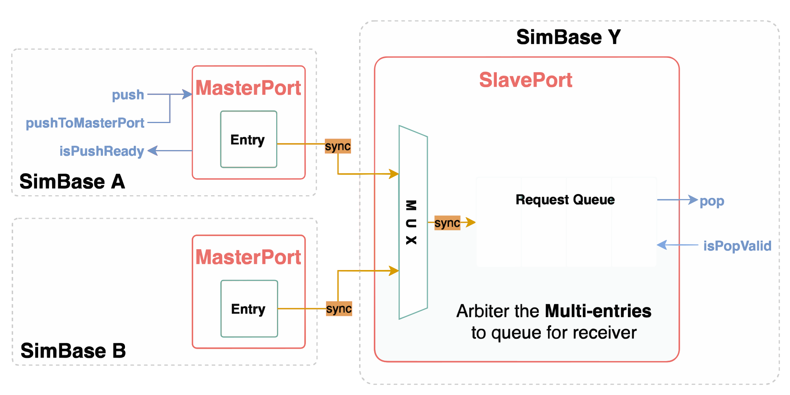
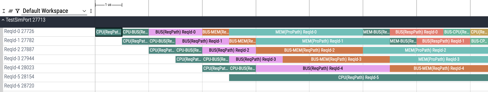

# SimPort - ACALSim User Guide

<!--
Copyright 2023-2026 Playlab/ACAL

Licensed under the Apache License, Version 2.0 (the "License");
you may not use this file except in compliance with the License.
You may obtain a copy of the License at

http://www.apache.org/licenses/LICENSE-2.0

Unless required by applicable law or agreed to in writing, software
distributed under the License is distributed on an "AS IS" BASIS,
WITHOUT WARRANTIES OR CONDITIONS OF ANY KIND, either express or implied.
See the License for the specific language governing permissions and
limitations under the License.
-->


---

- Author: Yen-Po Chen \<yenpo@twhpcedu.org\>, Chia-Pao Chiang \<daniel100373@gmail.com\>
- Date: 2025/03/13

([Back To Documentation Portal](/docs/README.md))

## Introduction

In ACALSim, we simulate the hardware behavior of request transmission between components (`SimBase`/`SimModule`) with a focus on realistic inter-component communication. Each hardware component can interact with others through multiple ports, which serve as communication bridges. To maintain transmission order and efficiency, ACALSim employs sophisticated arbitration and queue management when sending `SimPacket`s between `SimBase` or `SimModule` instances.



The communication framework utilizes two types of `SimPort`: `MasterPort` and `SlavePort`, representing the sender and receiver sides of transmission, respectively. Each `SimBase`/`SimModule` can contain multiple `MasterPort`s and `SlavePort`s, allowing for complex communication topologies. Notably, a single `SlavePort` can interface with multiple `MasterPort`s, enabling flexible and efficient multi-source communication paths within the simulation environment.


## QuickStart

### Creating and Connecting `SimPort`s

1. Create `MasterPort` and `SlavePort` instances:
    - Implement in the constructor of SimBase or SimModule.
        ``` cpp
        SimBase::SimBase() {
            // Create MasterPort
            this->addMasterPort("m_port_name");

            // Create SlavePort with ReqQueue is queue_size
            this->addSlavePort("s_port_name", queue_size);
        }
        ```

2. Establish connections:

    - Between `SimModule`s: Use the `void SimBase::registerModules()` method.
        ``` cpp
        void SimBase::registerModules() {
            // Get SimModule pointers
            auto module_m = this->getModule("m_port_simmodule_name");
            auto module_s = this->getModule("s_port_simmodule_name");

            // Define MasterPort/SlavePort name
            std::string m_port_name = "m_port_name_in_its_simmodule";
            std::string s_port_name = "s_port_name_in_its_simmodule";

            // Connect the MasterPort and SlavePort
            SimPortManager::ConnectPort(module_m, module_s, m_port_name, s_port_name);
        }
        ```
    - Between `SimBase`s: Use the `void SimTop::registerSimulators()` method.

        ``` cpp
        void SimTop::registerSimulators() {
            // Get SimBase pointers
            auto sim_m = this->getSimulator("m_port_simbase_name");
            auto sim_s = this->getSimulator("s_port_simbase_name");

            // Define MasterPort/SlavePort name
            std::string m_port_name = "m_port_name_in_its_simbase";
            std::string s_port_name = "s_port_name_in_its_simbase";

            // Connect the MasterPort and SlavePort
            SimPortManager::ConnectPort(sim_m, sim_s, m_port_name, s_port_name);
        }
        ```

###  Implementing Callback Functions

Override these crucial callbacks:

Handler for `MasterPort` packet storage capacity changes:
- Triggers when a `MasterPort` wins the arbitration and push the packet to the other's `SlavePort`.

``` cpp
void SimBase::masterPortRetry(const std::string& portName) {
  CLASS_INFO << "MasterPort is released. User can push the next packet into MasterPort";
}
```


### Transmitting SimPackets

Sending `SimPacket` or its derived objects via `MasterPort`:
- Using `MasterPort::push(...)`:

    ``` cpp
    #include "ACALSim.hh"
    using namespace acalsim;

    void DerivedSimBaseClass::sendPacketFnExample1() {
        auto            packet  = new SimPacket(...);
        MasterPort* m_port  = this->getMasterPort(/* mport_name*/);
        // Check MasterPort is ready to push SimPacket.
        if(m_port->isPushReady())
            this->push(packet);
        else
            CLASS_WARNING << "MasterPort is not available. SimPacket cannot be pushed into MasterPort"
    ```

This streamlined guide provides a clear pathway for setting up, configuring, and utilizing SimPorts in your ACALSim project, ensuring efficient communication between simulated hardware components.

## Design Purpose

In ACALSim framework, we design `SimChannel`, which supports inter-simulator communication for software simulations. However, in real hardware scenarios, many-to-one communication requires arbitration, and the hardware’s limited capacity for incoming requests(`SimPacket`) can cause backpressure. To address these challenges, we developed `SimPort`—a solution that integrates arbitration and backpressure management to ensure robust hardware communication.

- **Arbitration**: Determining which of the concurrent requests(`SimPacket`) from different SimBase instances should be received, based on a developer-configurable arbitration policy. 
- **Backpressure**: When the slave side can no longer accept requests(`SimPacket`) from the master side, the framework will properly respond with backpressure, informing the master side to stop sending further requests(`SimPacket`). Once backpressure is released, the framework provides a user-defined callback function, allowing the user to model the desired behavior.

## Operating Mechanism


The figure above illustrates multiple SimBase/SimModules connected via SimPort. In the SimPort design, the master side contains a single entry, while the slave side features a configurable queue. The framework then performs arbitration between multiple master-side entries and slave-side queues according to an arbitration policy (defaulting to round-robin). Within the framework, we provide the following APIs:

- **`MasrerPort::isPushReady()`**: Determines whether the data in the master-side entry has already been sent to the slave-side queue. 
- **`MasterPort::push()`**: Places a packet into the master-side entry. 
- **`SlavePort::isPopValid()`**: Checks whether there is a packet in the slave-side queue awaiting processing. 
- **`SlavePort::pop()`**: Removes a packet from the slave-side queue. 

Next, we will use a timing diagram to explain in detail when each of these APIs is executed and when to use the previously mentioned callback function.

Each iteration in the framework is split into **phase1** and **phase2**, and the behavior of our simulator takes place during **phase1**. Therefore, when **Simulator A** wants to send a packet to **Simulator B** at **Tick = T**, it invokes the `push` during phase1, placing the packet into the `MasterPort` entry. During phase2, the framework performs arbitration among all `MasterPort` entries. Once a given `MasterPort` wins arbitration, the packet moves from the `MasterPort` entry to the `SlavePort` queue, and an retry flag is set. Setting this flag indicates that the MasterPort has been released and is ready to send the next packet. Consequently, at **Tick = T + 1**, the framework calls `masterPortRetry`, a virtual function user can overwrite. The user can customize this callback to model the desired hardware behavior—for example, to send the next packet.

```cpp
virtual void masterPortRetry(const std::string& portName) {}
```

On the slave side, within **Simulator B**, we want to be able to reject incoming requests (`SimPacket`) when they cannot be processed. Unlike `SimChannel`, whether a `SimPort` accepts and processes the next request (`SimPacket`) is under user control. This control is implemented through the **`step()` function**, which runs during **phase1** of each iteration, allowing the user to pop packets from the **SlavePort** queue for processing based on the simulator’s current status.


In an event-driven simulation, a key principle is that we only simulate the points in time when events occur, skipping any intermediate time periods to speed up the entire simulation. Therefore, when designing how SimPort handles backpressure, we took this into account as well. In an actual hardware scenario, once backpressure occurs and until it is released, the transaction will not complete, so there is no need to simulate any behavior during that interval.

Therefore, assume **Simulator A** never wins the arbitration, so its `MasterPort` is never released. If, in a hardware scenario, **Simulator A** needs to send the next packet each cycle by reading a “ready” signal, we can instead leverage the **callback function** in our simulation framework. This way, **Simulator A** does not need to check `isPushReady` every tick; rather, it waits until the `MasterPort` is released, and then—in the next tick—uses the callback function to simulate the hardware behavior at that specific moment.

## Features

### MasterPort

ACALSim maintains framework flexibility by not fully simulating the hardware behavior of `MasterPort`. Instead, it focuses on ensuring proper packet ordering at the receiver side by simulating a single entry in the `MasterPort`. This entry is essentially a specialized `SimQueue` with a capacity of one.


> **Important ACALSim Constraints**:
> Within a single tick, any simulator or module can push one `SimPacket` to `MasterPort` via `MasterPort::push()`. This method returns `true` if the packet is successfully pushed, and `false` otherwise.

#### MasterPort APIs

- **`MasterPort::isPushReady()`**: Checks if the entry is ready for push at the current tick.
- **`MasterPort::push()`**: push the packet to MasterPort
- **`MasterPort::pop()`**: pop the packet from MasterPort. The retry flag will be set. (This API will only utilized by framework)

### SlavePort

`SlavePort` simulates the receiver side of hardware in ACALSim. It manages connections to multiple MasterPorts and handles arbitration among multiple entries.

Key features:

- Contains a single `ReqQueue` for incoming packets.
- User-defined `ReqQueue` size and arbitration strategy for system customization.
- Incoming packets undergo arbitration before entering the `ReqQueue`.
- Users must pop packets from the `ReqQueue` in the step function of `SimBase` / `SimModule`.
- After popping, users should call the accept function in `SimBase` / `SimModule` to formally accept the packet.


> **Important ACALSim Constraints**
> - Only one packet can be popped from the `ReqQueue` per tick. 
> - ACALSim automatically arbitrates one entry and pushes its packet to `ReqQueue` when space is available during a single tick.

#### SlavePort APIs
- **`bool SlavePort::empty()`**: Checks if the `ReqQueue` is empty.
- **`bool SlavePort::isPopValid()`**: Verifies if the `ReqQueue` is ready for packet popping.
- **`SimPacket* SlavePort::pop()`**: Pops a `SimPacket` from the `ReqQueue`. Returns the `SimPacket` pointer on success, nullptr otherwise.

This structure provides a robust and flexible framework for managing packet transmission and reception in the ACALSim environment.

### Managing MasterPort/SlavePort

The `SimPortManager` and `MasterPortOwner` classes in ACALSim provide a robust framework for managing and synchronizing multiple `MasterPort`s <>`SlavePort` connections within your hardware simulations. This section will walk you through their functionalities and usage.

The `SimPortManager` class orchestrates `MasterPort`s and `SlavePort`s in the simulation environment, offering the following key features:

1. SimPort Management
2. SimPort Connection 
3. Thread-Safe Packet Transmission and Communication
4. SimPort Initialization and Synchronization
5. SimPort Status and Pending Activity
6. Simport Handling

To support retry handling, `SimPortManager` inherits from `MasterPortOwner`, which defines the virtual function: **`virtual void masterPortRetry(const std::string& portName) = 0;`**. This ensures that `SimPortManager` can invoke masterPortRetry(name), allowing `MasterPort` to clear retry flags and proceed with packet forwarding.


#### APIs in `SimPortManager` Class
##### SimPort Management - MasterPort

- **`std::unordered_map<std::string, MasterPort*> m_ports`**
    - An internal map storing MasterPorts pointers, keyed by their names.
- **`void addMasterPort(const std::string& name, MasterPort* port)`**
    - Adds a MasterPort to the manager. Ensures that ports are not added with duplicate names.
    - Set the MasterPort owner for master port retry callback handling.
- **`MasterPort* getMasterPort(const std::string& name) const`** 
    - Add a MasterPort to the manager by name. Manager will create an instance and register to internal map.
##### SimPort Management - SlavePort
- **`std::unordered_map<std::string, SlavePort*> s_ports`**
    - An internal map storing SlavePorts pointers, keyed by their names.
- **`void addSlavePort(const std::string& name, SlavePort* port)`** 
    - Adds a SlavePort to the manager. Ensures that ports are not added with duplicate names.
- **`SlavePort* addSlavePort(const std::string& name, size_t req_queue_size, Arbiter* arbiter) const`**
    - Add a SlavePort to the manager by name. Manager will create an instance and register internal map.
    - The SlavePort will use a Round-Robin policy for arbitration with a default Request Queue Size of 1.

##### SimPort Connection
- **`static void ConnectPort(SimPortManager* master, SimPortManager* slave, std::string m_port_name, std::string s_port_name)`**
    - Establishes connections between `MasterPort` and `SlavePort`.
    - Allows connections between ports from different `SimPortManager` instances.
##### Thread-Safe Packet Transmission and Communication
- **`bool pushToMasterPort(const std::string& name, SimPacket* packet)`**
    - Pushes packets into the master port. 
    - `true` if the SimPacket has been pushed to MasterPort, otherwise false.
##### Port Initialization, Synchronization and MasterPort Retry
- **`void initSimPort()`**
    - Set Entry number and register entries.
    - Check `MasterPort`s <> `SlavePort` connection.
- **`void syncSimPort()`**
    - Arbitrate one the requests of all master ports
    - Pop the request from the master port of the winner to the `ReqQueue`
    - Update `MasterPort`/`SlavePort` status.
- **`void triggerRetryCallback(Tick t)`**
	- Invokes the masterPortRetry(name) callback if the MasterPort has its retry flag set and its retry timestamp differs from t.
	- Clear the retry flag after the callback is triggered.

##### SimPort Status and Pending Activity
The ACALSim framework may need to process pending requests in the slavePort during the subsequent cycle, even when the simulator's event queue is empty. To address this, the framework implements a crucial API : **`bool hasPendingActivityInSimPort()`**

This function serves three primary purposes:
- It checks for any pending activities within the slave ports.
- It checks for retry flags within the master ports.
- It is invoked during SimBase::interIterationUpdate() while the control thread prepares to calculate the next cycle for fast-forwarding.

By utilizing this API, ACALSim ensures that all pending slave and slave port activities are properly handled, maintaining simulation accuracy even in scenarios where the event queue might be temporarily empty. This mechanism contributes to the framework's robustness in managing complex inter-component communications and state updates.

## Single-Iteration Simulation Timeline


The execution of a single iteration in ACALSim follows a two-phase process:

### Phase #1: Parallel Simulator Execution
During this phase, all simulator threads run concurrently. Each thread executes the `SimBase::stepWrapperBase()` function, which encompasses the following tasks:

1. Extraction of all requests from inbound channels
2. Processing of events from the event queue that have expired at the current cycle
3. Triggering of the `SimBase::masterPortRetry()` function for master port back-pressure handling.
4. Execution of the `SimBase::step()` function

By the conclusion of Phase #1, each simulator may have pushed requests into its outbound `MasterPort`s.

### Phase #2: Synchronization and Update
In this phase, all simulator threads are temporarily paused. The control thread takes over to perform synchronization and updates through two key function calls:

- `SimBase::syncSimPort()`
- `SimBase::interIterationUpdate()`

During this phase, critical `SimPort` operations occur, including:

- Arbitration
- Insertion of requests into the `ReqQueue`
- Execution of relevant callbacks

This two-phase approach ensures proper synchronization and maintains the integrity of the simulation across all components.

## Data Passing Between `MasterPort` and `SlavePort`

### SimPacket flow in `MasterPort` and `SlavePort` and Timeline


1. **Tick t, Phase 1**: Initial Push to Master Port
    - If the entry in MasterPort is empty, the framework pushes the packet to the master port using **`SimPortManager::pushToMasterPort(std::string port_name, SimPacket* packet)`**.
	- Returns true if the packet is successfully
2. **Tick t, Phase 2**: Control Phase & Arbitration
    - The slave port, which can connect to multiple master ports, performs arbitration to select a master port if it is pop valid.
    - The packet is then moved from the master port to the slave port.
    - Simultaneously, the master port retry flag is set.
3. **Tick t+1, Phase 1**: Ownership and Back-Pressure Handling
    - In the next iteration (t+1), the master port owner and slave port owner are raised.
    - The master port owner can handle back-pressure using **`SimPortManager::MasterPortRetry(const std::string& port_name)`**.
    - The slave port owner can pop the packet from SlavePort during the **step function**.

### SimPort Arbitration and Packet Handling in the Next Iteration
**SimBase/SimModule** will be raised by SimPort handling in the next iteration only in the following scenarios:

1. **MasterPort Arbitration & Packet Forwarding**:
    - The MasterPort wins arbitration and forwards the packet to the SlavePort.
    - Trigger the callback **`void masterPortRetry(const std::string& portName)`** before executing the user-defined step function.
        - This callback is invoked only when the MasterPort successfully wins arbitration and removes the packet from its entry.
2. **SlavePort Receives the Packet**
    - The SlavePort retrieves the forwarded packet from the MasterPort for subsequent processing in step function.

## Framework Limitation

ACALSim does not model sender-side hardware behavior due to its potential for either out-of-order or in-order functionality. For simulation purposes, users should utilize `SimQueue` instead.

## Example - `src/testSimPort`

In the `testSimPort` project, we demonstrate how `SimPort` handles backpressure.


### Basic

#### Creating `SimPort` for Each Simulator Interface

```cpp
CPUCore::CPUCore(const std::string& name, size_t max_outstanding_requests, size_t total_requests,
                 size_t internal_resp_latency, size_t resp_queue_size)
    : ... {
	this->m_port = this->addMasterPort("bus-m");
	this->s_port = this->addSlavePort("bus-s", 1);
}
```

```cpp
CrossBar::CrossBar(const std::string& name, size_t internal_latency, size_t queue_size)
    : ... {
	this->m_port_to_cpu   = this->addMasterPort("cpu-m");
	this->m_port_to_mem   = this->addMasterPort("mem-m");
	this->s_port_from_cpu = this->addSlavePort("cpu-s", 1);
	this->s_port_from_mem = this->addSlavePort("mem-s", 1);
}
```

```cpp
Memory::Memory(const std::string& name, size_t internal_resp_latency, size_t queue_size)
    : ... {
	this->m_port = this->addMasterPort("bus-m");
	this->s_port = this->addSlavePort("bus-s", 1);
}

```


#### Establishing Connectivity Between `SimBase` Instances

```cpp
// src/TestSimPortTop.cc
acalsim::SimPortManager::ConnectPort(this->cpu, this->bus, "bus-m", "cpu-s");
acalsim::SimPortManager::ConnectPort(this->bus, this->cpu, "cpu-m", "bus-s");
acalsim::SimPortManager::ConnectPort(this->bus, this->mem, "mem-m", "bus-s");
acalsim::SimPortManager::ConnectPort(this->mem, this->bus, "bus-m", "mem-s");
```

### Simulation Flow

In this example, each simulator maintains a queue (the yellow block) to store packets in both the request and response paths. For instance, a CPU takes `kInternalLatency` (a configurable internal latency) to generate a request packet, place it in the `ReqOutQueue`, and then attempt to push the packet into its master port. In `CPUCore::pushToReqQueue`, the function checks if the queue transitions from empty to non-empty due to the newly pushed packet, which indicates there were no pending packets in the `ReqOutQueue` previously. If this transition does not occur, it implies that the downstream crossbar refused to receive the packet, signifying a backpressure condition. 

```cpp
void CPUCore::pushToReqQueue(BaseReqPacket* packet, acalsim::Tick when) {
    // Check if the ReqOutQueue was previously empty
    const bool was_empty = this->req_out_queue.empty();

    // Attempt to push the packet into the ReqOutQueue and ensure success
    LABELED_ASSERT_MSG(this->req_out_queue.push(packet, when), name,
                       "Failed to push to the ReqOutQueue: the queue is full.");

    std::string req_name = "ReqId-" + std::to_string(packet->getReqId());
    acalsim::top->addChromeTraceRecord(acalsim::ChromeTraceRecord::createDurationEvent(
        "B", "TestSimPort", "CPU(ReqPath) " + req_name, acalsim::top->getGlobalTick(), "", req_name));

    // This ensures that requests will be when the queue transitions from empty to non-empty.
    if (was_empty) { this->tryIssueRequest(); }
}
```

In the previous function, we push a packet into the ReqOutQueue with a time step that indicates its generation latency. Therefore, when we issue a request, we must first ensure that the request packet has been generated.

```cpp
void CPUCore::tryIssueRequest() {
    if (this->req_out_queue.empty()) { return; }

    const auto rc       = acalsim::top->getRecycleContainer();
    const auto min_tick = this->req_out_queue.getMinTick();
    auto       callback = [this]() { this->issueRequest(); };

    // Issue a request immediately if the earliest tick is less than or equal to CurrTick
    if (acalsim::top->getGlobalTick() >= min_tick) {
        callback();
    } else {
        auto event = rc->acquire<CallBackEvent<void()>>(&CallBackEvent<void()>::renew, callback);
        this->scheduleEvent(event, min_tick);
    }
}
```

Finally, we use the `push` API to insert the packet into the master port. However, we must first check if the master port is available by using the `isPushReady` API. If we cannot push the packet into the master port, it indicates backpressure, meaning the downstream cannot accept the packet.

```cpp
void CPUCore::issueRequest() {
	// 1. Make sure that ReqOutQueue can pop the packet.
	if (!this->req_out_queue.isPopValid()) { return; }

	// 2. Verify that the number of outstanding requests does not exceed the hardware constraints.
	if (!this->outstanding_req_queue.isPushReady()) { return; }

	// 3. Ensure the output port is ready to accept a new packet.
	if (!this->m_port->isPushReady()) { return; }

	// 4. Check if the earliest request in the queue is ready to be issued
	if (this->req_out_queue.getMinTick() > acalsim::top->getGlobalTick()) { return; }

	// 5-1. Process: Pop the RspPacket from ReqOutQueue and update OutstandingReqQueue
	auto packet = this->popFromReqQueue();
	LABELED_ASSERT_MSG(packet, name, "Failed to pop the ReqPacket from the ReqOutQueue.");
	LABELED_ASSERT_MSG(this->outstanding_req_queue.add(packet->getReqId(), true), name,
	                   "Failed to push the ReqPacket to the OutstandingReqQueue.");
	std::string req_name = "ReqId-" + std::to_string(packet->getReqId());
	LABELED_INFO(this->name) << req_name << ": [2] Pop out the ReqPacket from ReqOutQueue and push to OutPort.";
	acalsim::top->addChromeTraceRecord(acalsim::ChromeTraceRecord::createDurationEvent(
	    "E", "TestSimPort", "CPU(ReqPath) " + req_name, acalsim::top->getGlobalTick(), "", req_name));

	// 5-2. Process: Issue Outbound Request the master port.
	LABELED_ASSERT_MSG(this->m_port->push(packet), name, "Failed to push the ReqPacket to the OutPort.");
	acalsim::top->addChromeTraceRecord(acalsim::ChromeTraceRecord::createDurationEvent(
	    "B", "TestSimPort", "CPU-BUS(ReqPath) " + req_name, acalsim::top->getGlobalTick(), "", req_name));
}
```

Previously, in the SimPort introduction section, we explained why we designed the `masterPortRetry` callback function. In our demonstration example, when backpressure occurs, the generated request remains in the queue. Once backpressure is relieved, the framework invokes the user-overridden `CPUCore::masterPortRetry` method to attempt popping the packet from the `ReqOutQueue` and pushing it into the master port. With this callback function, the `CPUCore` no longer needs to check every cycle whether it can push a packet when the `ReqOutQueue` is non-empty.


```cpp
void CPUCore::masterPortRetry(const std::string& portName) {
	const auto rc = acalsim::top->getRecycleContainer();
	if (this->m_port->getName() == portName) { this->tryIssueRequest(); }
}
```

The rest of the simulator—whether for request or response paths—follows a similar design. The only difference is that each simulator can be configured with a different internal latency or a different queue size. For a more in-depth look, please refer to `src/testSimPort`.


### Analyzing Backpressure Through Visualization with ChromeTrace

**Below is a Chrome Trace visualization of each request’s latency in both the request path and the response path.** 
We can also observe where backpressure occurs from this diagram. 
Here are the definitions of each trace name and system configuration:

- System Configuration:

    ```cpp
    size_t cpu_total_requests       = 100;
    size_t cpu_latency              = 1;
    size_t bus_latency              = 2;
    size_t mem_latency              = 5;
    size_t queue_size               = 2;
    size_t cpu_outstanding_requests = 5;
    ```

- Each Trace Name:
    1. **CPU(ReqPath) ReqId-X**: The internal latency of Request X in the CPU request path. 
    2. **CPU-BUS(ReqPath) ReqId-X**: The latency from the CPU to the Bus for Request X. 
    3. **BUS(ReqPath) ReqId-X**: The internal latency of Request X in the Bus request path. 
    4. **BUS-MEM(ReqPath) ReqId-X**: The latency from the Bus to the Memory for Request X. 
    5. **MEM(ProPath) ReqId-X**: The internal processing latency of Request X in the Memory. 
    6. **MEM-BUS(RespPath) ReqId-X**: The latency from the Memory to the Bus for Request X. 
    7. **BUS(RespPath) ReqId-X**: The internal latency of Request X in the Bus response path. 
    8. **BUS-CPU(RespPath) ReqId-X**: The latency from the Bus to the CPU for Request X. 
    9. **CPU(RespPath) ReqId-X**: The internal latency of Request X in the CPU response path. 



Having established the naming and definitions for each stage of latency, we can first look at Request-0. By examining its latency, we can understand what latency looks like when there is no backpressure. We use this first request as a reference: if any subsequent request shows a longer latency at a certain stage compared to the first request, that suggests backpressure may have occurred.

From the diagram, we can observe that **Request-2** experiences backpressure on the **Bus to Memory** stage. Originally, the request would have been transferred from the Bus to the Memory in just one cycle, but due to backpressure, it takes four cycles. This occurs because the Memory’s process queue can only hold two entries. After receiving **Request-0** and **Request-1**, it cannot accept the next request until **Request-0** completes processing.

Once backpressure occurs downstream, it propagates upstream. As a result, **Request-4** and **Request-5** end up getting stalled at even earlier stages. 

---

([Back To Documentation Portal](/docs/README.md))
