# Generating Architecture Diagrams

<!--
Copyright 2023-2026 Playlab/ACAL

Licensed under the Apache License, Version 2.0 (the "License");
you may not use this file except in compliance with the License.
You may obtain a copy of the License at

http://www.apache.org/licenses/LICENSE-2.0

Unless required by applicable law or agreed to in writing, software
distributed under the License is distributed on an "AS IS" BASIS,
WITHOUT WARRANTIES OR CONDITIONS OF ANY KIND, either express or implied.
See the License for the specific language governing permissions and
limitations under the License.
-->

This guide explains how to generate PNG/SVG images from the PlantUML architecture diagram.

## Quick Start

**Easiest method** - just run the provided script:

```bash
cd docs/sst-integration
./generate-diagram.sh
```

This will automatically try multiple methods and generate `architecture-diagram.png`.

---

## Manual Methods

### Method 1: Online Editor (No Installation Required)

**Best for**: Quick one-time generation

1. Visit: http://www.plantuml.com/plantuml/uml/

2. Copy the entire contents of `architecture-diagram.puml`

3. Paste into the editor

4. The diagram renders automatically

5. Download PNG/SVG using the download button

**Alternative online editors:**
- https://plantuml-editor.kkeisuke.com/
- https://www.planttext.com/

### Method 2: VSCode Extension (Best for Development)

**Best for**: Frequent diagram updates

1. **Install PlantUML extension:**
   ```
   Open VSCode → Extensions → Search "PlantUML" → Install (by jebbs)
   ```

2. **Open** `architecture-diagram.puml` in VSCode

3. **Preview:**
   - Press `Alt+D` (Windows/Linux) or `Cmd+D` (Mac)
   - Or right-click → "Preview Current Diagram"

4. **Export:**
   - Right-click in preview
   - Select "Export Current Diagram"
   - Choose format: PNG, SVG, PDF, etc.
   - Choose location

**Extension features:**
- Real-time preview as you edit
- Multiple export formats
- Syntax highlighting
- Auto-completion

### Method 3: Command Line with PlantUML

**Best for**: Automation, CI/CD, batch processing

#### Option A: Using PlantUML CLI (if installed)

```bash
# Install PlantUML first
# macOS:
brew install plantuml

# Ubuntu/Debian:
sudo apt install plantuml

# Generate PNG
plantuml -tpng architecture-diagram.puml

# Generate SVG (vector, scales better)
plantuml -tsvg architecture-diagram.puml

# Generate PDF
plantuml -tpdf architecture-diagram.puml
```

#### Option B: Using Java + PlantUML JAR

```bash
# Download PlantUML jar (one time)
curl -L -o plantuml.jar "https://github.com/plantuml/plantuml/releases/download/v1.2024.3/plantuml-1.2024.3.jar"

# Generate PNG
java -jar plantuml.jar -tpng architecture-diagram.puml

# Generate SVG
java -jar plantuml.jar -tsvg architecture-diagram.puml

# Generate multiple formats
java -jar plantuml.jar -tpng -tsvg -tpdf architecture-diagram.puml
```

### Method 4: Web Service API (Programmatic)

**Best for**: Web integration, dynamic generation

```bash
# Encode the PlantUML file
ENCODED=$(python3 -c "
import zlib
import base64

with open('architecture-diagram.puml', 'r') as f:
    content = f.read()
    zlibbed = zlib.compress(content.encode('utf-8'))
    compressed = zlibbed[2:-4]
    encoded = base64.urlsafe_b64encode(compressed).decode('utf-8').replace('=', '')
    print(encoded)
")

# Download PNG
curl -o architecture-diagram.png "http://www.plantuml.com/plantuml/png/$ENCODED"

# Download SVG
curl -o architecture-diagram.svg "http://www.plantuml.com/plantuml/svg/$ENCODED"
```

### Method 5: Docker (Isolated Environment)

**Best for**: Reproducible builds, CI/CD

```bash
# Pull PlantUML Docker image
docker pull plantuml/plantuml

# Generate PNG
docker run --rm -v $(pwd):/data plantuml/plantuml -tpng /data/architecture-diagram.puml

# Generate SVG
docker run --rm -v $(pwd):/data plantuml/plantuml -tsvg /data/architecture-diagram.puml
```

---

## Output Formats

PlantUML supports many output formats:

| Format | Extension | Use Case |
|--------|-----------|----------|
| PNG | `.png` | General use, presentations, documentation |
| SVG | `.svg` | Vector graphics, scales to any size, web |
| PDF | `.pdf` | Printing, high-quality documents |
| EPS | `.eps` | Publishing, LaTeX documents |
| LaTeX | `.tex` | Academic papers |
| ASCII Art | `.txt` | Plain text, email |

**Recommended:**
- **PNG** for GitHub README, general documentation
- **SVG** for websites, when you need scaling
- **PDF** for presentations, high-quality prints

---

## Customizing Output

### High-Resolution PNG

```bash
# 300 DPI for printing
java -DPLANTUML_LIMIT_SIZE=8192 -jar plantuml.jar -tpng architecture-diagram.puml

# Or using CLI
plantuml -tpng -Sresolution=300 architecture-diagram.puml
```

### Specific Output Filename

```bash
# Output to specific file
plantuml -tpng -o /path/to/output architecture-diagram.puml

# Rename output
plantuml -tpng architecture-diagram.puml
mv architecture-diagram.png sst-integration-architecture.png
```

### Multiple Diagrams

If your `.puml` file contains multiple diagrams separated by `@startuml` and `@enduml`:

```bash
# Generates: architecture-diagram-001.png, architecture-diagram-002.png, etc.
plantuml -tpng architecture-diagram.puml
```

---

## Automation

### Makefile Integration

Add to `docs/sst-integration/Makefile`:

```makefile
.PHONY: diagrams clean-diagrams

diagrams: architecture-diagram.png

architecture-diagram.png: architecture-diagram.puml
	plantuml -tpng $<

clean-diagrams:
	rm -f *.png *.svg
```

Usage:
```bash
make diagrams        # Generate all diagrams
make clean-diagrams  # Remove generated files
```

### Git Pre-Commit Hook

Auto-generate diagrams before committing:

`.git/hooks/pre-commit`:
```bash
#!/bin/bash
cd docs/sst-integration
if [ -f architecture-diagram.puml ]; then
    plantuml -tpng architecture-diagram.puml
    git add architecture-diagram.png
fi
```

### CI/CD (GitHub Actions)

`.github/workflows/diagrams.yml`:
```yaml
name: Generate Diagrams

on:
  push:
    paths:
      - 'docs/sst-integration/*.puml'

jobs:
  generate:
    runs-on: ubuntu-latest
    steps:
      - uses: actions/checkout@v3
      
      - name: Generate PlantUML diagrams
        uses: cloudbees/plantuml-github-action@master
        with:
          args: -v -tpng docs/sst-integration/*.puml
      
      - name: Commit diagrams
        run: |
          git config user.name "GitHub Actions"
          git config user.email "actions@github.com"
          git add docs/sst-integration/*.png
          git commit -m "Auto-generate diagrams" || exit 0
          git push
```

---

## Troubleshooting

### Issue: "Cannot find GraphViz"

PlantUML uses GraphViz for some diagram types. Install it:

```bash
# macOS
brew install graphviz

# Ubuntu/Debian
sudo apt install graphviz

# Verify
dot -V
```

### Issue: "Diagram too large"

Increase size limit:

```bash
java -DPLANTUML_LIMIT_SIZE=16384 -jar plantuml.jar -tpng architecture-diagram.puml
```

### Issue: "Syntax error in PlantUML"

Validate your PlantUML syntax:

```bash
# Check for syntax errors
plantuml -syntax architecture-diagram.puml

# Or use online validator
# Copy-paste to: http://www.plantuml.com/plantuml/uml/
```

### Issue: "Font rendering issues"

Specify font explicitly in PlantUML:

```plantuml
@startuml
skinparam defaultFontName Arial
skinparam defaultFontSize 12
...
@enduml
```



---

## Recommended Workflow

### For Documentation

1. **Edit** `architecture-diagram.puml` as needed
2. **Preview** in VSCode (if using extension) or online editor
3. **Generate PNG** for inclusion in markdown:
   ```bash
   ./generate-diagram.sh
   ```
4. **Commit both** `.puml` source and `.png` output:
   ```bash
   git add architecture-diagram.puml architecture-diagram.png
   git commit -m "Update architecture diagram"
   ```

### For Presentations

1. Generate high-resolution PNG or SVG:
   ```bash
   plantuml -tsvg architecture-diagram.puml
   ```
2. Import SVG into PowerPoint/Keynote
3. SVG scales perfectly to any size

### For Publications

1. Generate EPS or PDF:
   ```bash
   plantuml -tpdf architecture-diagram.puml
   ```
2. Include in LaTeX or Word documents

---

## Additional Resources

### Official Documentation
- PlantUML Website: https://plantuml.com/
- Language Reference: https://plantuml.com/guide
- Deployment Guide: https://plantuml.com/deployment

### Useful Tools
- PlantUML Web Server: http://www.plantuml.com/plantuml/
- PlantUML Editor: https://plantuml-editor.kkeisuke.com/
- Real-time PlantUML: https://www.planttext.com/

### Examples and Inspiration
- PlantUML Examples: https://real-world-plantuml.com/
- Component Diagrams: https://plantuml.com/component-diagram
- Sequence Diagrams: https://plantuml.com/sequence-diagram

---

## Summary

**Quick generation:**
```bash
./generate-diagram.sh
```

**Best quality:**
```bash
plantuml -tsvg architecture-diagram.puml
```

**For GitHub/docs:**
```bash
plantuml -tpng architecture-diagram.puml
```

**For presentations:**
```bash
plantuml -tpng -Sresolution=300 architecture-diagram.puml
```

---

**Copyright 2023-2026 Playlab/ACAL**  
Licensed under the Apache License, Version 2.0

