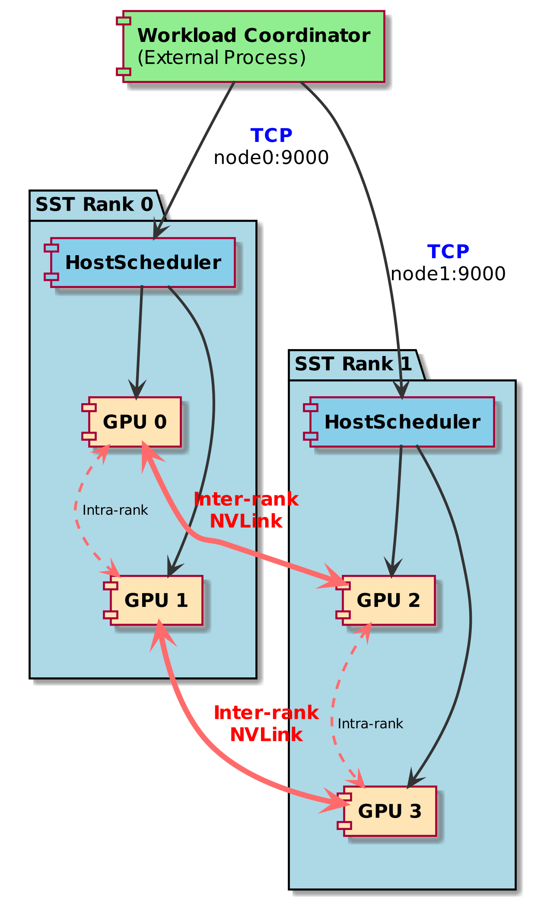
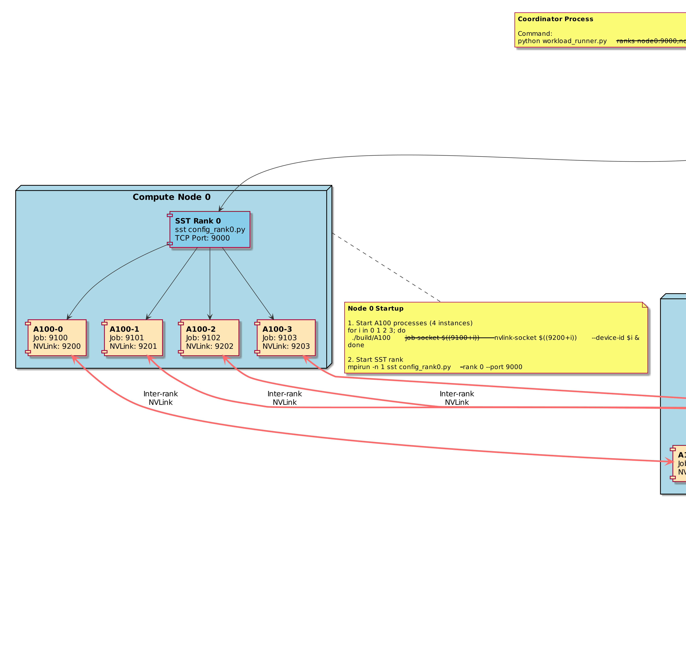

# Scalable Multi-Rank Architecture

<!--
Copyright 2023-2026 Playlab/ACAL

Licensed under the Apache License, Version 2.0 (the "License");
you may not use this file except in compliance with the License.
You may obtain a copy of the License at

http://www.apache.org/licenses/LICENSE-2.0

Unless required by applicable law or agreed to in writing, software
distributed under the License is distributed on an "AS IS" BASIS,
WITHOUT WARRANTIES OR CONDITIONS OF ANY KIND, either express or implied.
See the License for the specific language governing permissions and
limitations under the License.
-->

## Table of Contents

- [1. Overview](#1-overview)
- [2. Architecture](#2-architecture)
  - [2.1 Overview Diagram](#21-overview-diagram)
  - [2.2 Layered Design](#22-layered-design)
  - [2.3 Multi-Rank Topology](#23-multi-rank-topology)
  - [2.4 Component Responsibilities](#24-component-responsibilities)
- [3. Deployment](#3-deployment)
  - [3.1 Single-Node Multi-GPU](#31-single-node-multi-gpu)
  - [3.2 Multi-Node Deployment](#32-multi-node-deployment)
  - [3.3 Port Allocation](#33-port-allocation)
- [4. Scalability Analysis](#4-scalability-analysis)
- [5. Use Cases](#5-use-cases)
- [6. Implementation Guide](#6-implementation-guide)

---

## 1. Overview

While ACALSim excels at cycle-accurate simulation of individual GPU devices, modern LLM inference requires coordinating tens to hundreds of GPUs. The **scalable multi-rank architecture** enables production-scale simulation by:

1. **Distributing GPUs across multiple SST ranks** - Each SST rank (MPI process) manages a subset of GPUs (typically 4-8 per rank)
2. **Separating scheduling from simulation** - External coordinator handles global scheduling, SST ranks handle device execution
3. **Modeling both intra-rank and inter-rank communication** - NVLink within a node, NVSwitch or InfiniBand between nodes
4. **Supporting linear scaling** - Add more ranks to simulate more GPUs without degrading performance

**Key Benefits:**

- ✅ **Scalability**: Simulate 32-128+ GPUs across multiple compute nodes
- ✅ **Flexibility**: Supports tensor parallelism, pipeline parallelism, and expert parallelism
- ✅ **Isolation**: Each GPU runs in its own ACALSim process with independent state
- ✅ **Realism**: Models realistic network topologies (NVSwitch full-mesh, ring, mesh)

---

## 2. Architecture

### 2.1 Overview Diagram

The following diagram shows the scalable multi-rank architecture with 2 SST ranks managing 4 GPUs:



**Key Elements:**
- **External Coordinator**: Global job scheduling and workload distribution
- **SST Ranks**: Per-node simulation (each rank manages 2-8 GPUs)
- **Inter-rank NVLink**: Cross-node GPU communication via SST Links
- **Intra-rank NVLink**: Local NVLink mesh within each rank

### 2.2 Layered Design

The architecture consists of four distinct layers, each with clear responsibilities:


**Application Layer** (External Process)
- **Component**: Workload Driver / InferenceServer C++
- **Responsibility**: Global job scheduling, load balancing, tensor/pipeline parallelism orchestration
- **Location**: Separate process (can run on coordinator node)
- **Communication**: TCP to all SST ranks

**SST Dispatcher Layer** (Per Rank)
- **Component**: HostSchedulerComponent
- **Responsibility**: Lightweight job dispatcher, routes to local GPUs, completion aggregation
- **Location**: SST Rank process
- **Communication**: TCP (external) + SST Links (internal)

**Device Wrapper Layer** (Per GPU)
- **Component**: GPUDeviceComponent
- **Responsibility**: Wraps ACALSim A100 process, dual-port TCP management, inter-device routing
- **Location**: SST Rank process
- **Communication**: Dual TCP to A100 + SST Links to other GPUs

**Device Simulation Layer** (Per GPU)
- **Component**: ACALSim A100 Process
- **Responsibility**: Pure cycle-accurate simulation (HBM/DDR, compute, two-phase execution)
- **Location**: Standalone process
- **Communication**: Dual TCP (job port + NVLink port)

### 2.3 Multi-Rank Topology

For larger deployments, the architecture scales linearly. The following diagram shows a 12-GPU deployment across 3 SST ranks (see Appendix for detailed view):

> **Note**: For space-constrained papers, use the 2-rank diagram above. The 12-GPU diagram is included in the appendix for reference.

**Key Design Elements:**

1. **External Coordinator**
   - Python workload driver or C++ InferenceServer
   - Connects to all SST ranks via TCP (e.g., node0:9000, node1:9000, node2:9000)
   - Makes global scheduling decisions
   - Implements tensor/pipeline parallelism logic

2. **SST Rank per Node**
   - Each compute node runs one SST rank (MPI process)
   - Manages 4-8 local GPUs (GPUDeviceComponent instances)
   - HostSchedulerComponent provides TCP interface for coordinator

3. **Dual-Port Architecture per GPU**
   - **Job Port (91XX)**: Control messages (submit, complete, shutdown)
   - **NVLink Port (92XX)**: High-bandwidth inter-device data transfers
   - Prevents NVLink traffic from blocking control messages

4. **NVLink Communication**
   - **Intra-rank**: GPUs within same rank communicate via SST Links (low latency)
   - **Inter-rank**: GPUs across ranks use SST inter-rank Links (higher latency, models network)

### 2.4 Component Responsibilities

| Component | Scheduling | Batching | Memory Mgmt | Device Simulation |
|-----------|:----------:|:--------:|:-----------:|:-----------------:|
| **External Coordinator** | ✅ | ✅ | ✅ | ❌ |
| **HostSchedulerComponent** | ❌ | ❌ | ❌ | ❌ |
| **GPUDeviceComponent** | ❌ | ❌ | ❌ | ❌ |
| **ACALSim A100** | ❌ | ❌ | ❌ | ✅ |

**Critical Design Principle**: SST components are **lightweight dispatchers** only. All scheduling decisions (batcher, memory manager, job scheduler) happen in the external coordinator process.

---

## 3. Deployment

### 3.1 Single-Node Multi-GPU

For testing or small-scale experiments (4-8 GPUs on one node):

```bash
# Terminal 1: Start 4 ACALSim A100 processes
for i in 0 1 2 3; do
    ./build/A100 \
        --job-socket $((9100 + i)) \
        --nvlink-socket $((9200 + i)) \
        --device-id $i \
        > gpu${i}.log 2>&1 &
done

# Terminal 2: Start SST Rank 0 (single rank)
SST_LIB_PATH=build mpirun -n 1 sst \
    configs/multi_device_4gpu.py \
    -- --rank 0 --port 9000

# Terminal 3: Run workload coordinator
python3 workload_runner.py \
    --ranks localhost:9000 \
    --workload llama2_7b.json
```

### 3.2 Multi-Node Deployment

For production-scale simulation (32-128+ GPUs across multiple nodes):



**Node 0 (Coordinator + Rank 0):**
```bash
# Start 4 A100 processes (GPUs 0-3)
for i in 0 1 2 3; do
    ./build/A100 \
        --job-socket $((9100 + i)) \
        --nvlink-socket $((9200 + i)) \
        --device-id $i \
        > node0_gpu${i}.log 2>&1 &
done

# Start SST Rank 0
mpirun -n 1 sst configs/multi_rank_config.py \
    -- --rank 0 --port 9000 --num-devices 4 &

# Start coordinator (connects to all ranks)
python3 workload_runner.py \
    --ranks node0:9000,node1:9000,node2:9000 \
    --workload llama2_70b.json \
    --parallelism tensor-3way
```

**Node 1 (Rank 1):**
```bash
# Start 4 A100 processes (GPUs 4-7, same local ports)
for i in 0 1 2 3; do
    ./build/A100 \
        --job-socket $((9100 + i)) \
        --nvlink-socket $((9200 + i)) \
        --device-id $((4 + i)) \  # Global device ID
        > node1_gpu${i}.log 2>&1 &
done

# Start SST Rank 1
mpirun -n 1 sst configs/multi_rank_config.py \
    -- --rank 1 --port 9000 --num-devices 4
```

**Node 2 (Rank 2):**
```bash
# Start 4 A100 processes (GPUs 8-11)
for i in 0 1 2 3; do
    ./build/A100 \
        --job-socket $((9100 + i)) \
        --nvlink-socket $((9200 + i)) \
        --device-id $((8 + i)) \  # Global device ID
        > node2_gpu${i}.log 2>&1 &
done

# Start SST Rank 2
mpirun -n 1 sst configs/multi_rank_config.py \
    -- --rank 2 --port 9000 --num-devices 4
```

### 3.3 Port Allocation

| Node | SST Rank | SST TCP Port | GPU Local IDs | GPU Global IDs | Job Ports | NVLink Ports |
|------|----------|--------------|---------------|----------------|-----------|--------------|
| 0 | 0 | 9000 | 0-3 | 0-3 | 9100-9103 | 9200-9203 |
| 1 | 1 | 9000 | 0-3 | 4-7 | 9100-9103 | 9200-9203 |
| 2 | 2 | 9000 | 0-3 | 8-11 | 9100-9103 | 9200-9203 |

**Key Points:**

- SST TCP port (9000) is **the same on all nodes** (external coordinator connects via hostname:port)
- Job/NVLink ports (91XX/92XX) are **local to each node** (same range on all nodes)
- Global device IDs are unique across all ranks (0-11 in this example)

---

## 4. Scalability Analysis

### Linear Scaling

The architecture supports linear scaling up to hundreds of GPUs:

| Configuration | SST Ranks | GPUs per Rank | Total GPUs | A100 Processes | Total Processes |
|---------------|-----------|---------------|------------|----------------|-----------------|
| Small | 1 | 4 | 4 | 4 | 6 |
| Medium | 4 | 8 | 32 | 32 | 37 |
| Large | 16 | 8 | 128 | 128 | 145 |
| X-Large | 32 | 8 | 256 | 256 | 289 |

**Process Breakdown:**
- **A100 Processes**: 1 per GPU
- **SST Ranks**: 1 per node (typically)
- **Coordinator**: 1 global process

**Expected Performance:**

| Metric | Single Rank (4 GPU) | Multi-Rank (32 GPU) | Multi-Rank (128 GPU) |
|--------|---------------------|---------------------|----------------------|
| Throughput | 4× single GPU | 32× single GPU | 128× single GPU |
| Latency (intra-rank) | ~100 ns | ~100 ns | ~100 ns |
| Latency (inter-rank) | N/A | ~1-10 μs | ~1-10 μs |
| Memory per Rank | ~20 GB | ~80 GB | ~80 GB |
| Coordinator CPU | <5% | <10% | <15% |

### Bottleneck Analysis

1. **Coordinator CPU**: For 128+ GPUs, coordinator may become bottleneck
   - **Solution**: Hierarchical scheduling (per-rack coordinators)

2. **Network Bandwidth**: Inter-rank NVLink transfers
   - **Solution**: Use InfiniBand for inter-node, NVSwitch for intra-node

3. **Memory per Rank**: Each rank needs ~10-20 GB per GPU
   - **Solution**: Distribute across high-memory nodes (256+ GB)

---

## 5. Use Cases

### 5.1 Tensor Parallelism

**LLaMA-2 70B on 32 GPUs (4 ranks × 8 GPUs):**

```bash
python3 workload_runner.py \
    --ranks node0:9000,...,node3:9000 \
    --workload llama2_70b_tp32.json \
    --parallelism tensor
```

- Model weights sharded across 32 GPUs (÷32 per GPU)
- AllReduce after each layer's output projection
- Coordinator distributes layers to GPUs in round-robin

### 5.2 Pipeline Parallelism

**GPT-3 175B on 64 GPUs (8 ranks × 8 GPUs):**

```bash
python3 workload_runner.py \
    --ranks node0:9000,...,node7:9000 \
    --workload gpt3_175b_pp64.json \
    --parallelism pipeline
```

- 96 layers distributed across 64 GPUs (1.5 layers per GPU)
- Micro-batching with bubble minimization
- Coordinator manages pipeline stage dependencies

### 5.3 Expert Parallelism (MoE)

**MoE model on 128 GPUs (16 ranks × 8 GPUs):**

```bash
python3 workload_runner.py \
    --ranks node0:9000,...,node15:9000 \
    --workload moe_tp128.json \
    --parallelism expert
```

- 128 experts distributed across 128 GPUs (1 per GPU)
- Dynamic routing based on token assignments
- Coordinator implements expert selection policy

---

## 6. Implementation Guide

### Step 1: SST Configuration (multi_rank_config.py)

```python
import sst

# Parse command-line args
rank = int(sys.argv[sys.argv.index('--rank') + 1])
port = int(sys.argv[sys.argv.index('--port') + 1])
num_devices = int(sys.argv[sys.argv.index('--num-devices') + 1])

# Create HostSchedulerComponent
host = sst.Component("host", "acalsim.HostSchedulerComponent")
host.addParams({
    "rank": rank,
    "num_devices": num_devices,
    "tcp_port": port,
    "verbose": 1
})

# Create GPUDeviceComponents
devices = []
for i in range(num_devices):
    dev = sst.Component(f"gpu{i}", "acalsim.GPUDeviceComponent")
    dev.addParams({
        "device_type": "A100",
        "device_id": rank * num_devices + i,  # Global ID
        "local_device_id": i,                  # Local ID
        "hbm_size_gb": 80,
        "job_port": 9100 + i,
        "nvlink_port": 9200 + i
    })
    devices.append(dev)
    
    # Connect to host
    link = sst.Link(f"host_to_gpu{i}")
    link.connect(
        (host, f"device_port_{i}", "1ns"),
        (dev, "host_port", "1ns")
    )

# Intra-rank NVLink mesh (within this rank)
for i in range(num_devices):
    for j in range(i + 1, num_devices):
        nvlink = sst.Link(f"nvlink_{i}_{j}")
        nvlink.connect(
            (devices[i], f"nvlink_port_{j}", "100ps"),  # NVSwitch: ~100ps
            (devices[j], f"nvlink_port_{i}", "100ps")
        )

# Inter-rank NVLink (between ranks) - managed by SST inter-rank links
# This requires SST MPI configuration, see SST documentation for details
```

### Step 2: Coordinator Implementation

```python
# workload_coordinator.py
import socket
import json
from typing import List

class MultiRankCoordinator:
    def __init__(self, rank_addresses: List[str]):
        """
        rank_addresses: ["node0:9000", "node1:9000", ...]
        """
        self.ranks = rank_addresses
        self.rank_sockets = []
        
        # Connect to all ranks
        for addr in self.ranks:
            host, port = addr.split(':')
            sock = socket.socket(socket.AF_INET, socket.SOCK_STREAM)
            sock.connect((host, int(port)))
            self.rank_sockets.append(sock)
    
    def submit_job(self, rank_id: int, job: dict):
        """Submit job to specific rank."""
        sock = self.rank_sockets[rank_id]
        payload = json.dumps(job).encode()
        sock.sendall(len(payload).to_bytes(4, 'little'))
        sock.sendall(payload)
    
    def wait_completion(self, rank_id: int) -> dict:
        """Wait for job completion from rank."""
        sock = self.rank_sockets[rank_id]
        length = int.from_bytes(sock.recv(4), 'little')
        data = sock.recv(length)
        return json.loads(data.decode())
    
    def distribute_tensor_parallel(self, workload: dict, num_ranks: int):
        """Distribute tensor parallel workload across ranks."""
        for layer_id, layer in enumerate(workload['layers']):
            target_rank = layer_id % num_ranks
            self.submit_job(target_rank, layer)
        
        # Wait for all completions
        results = []
        for rank_id in range(num_ranks):
            result = self.wait_completion(rank_id)
            results.append(result)
        
        return results
```

### Step 3: Run Full Stack

```bash
# Automation script: start_multi_rank.sh
#!/bin/bash

NODES=(node0 node1 node2)
GPUS_PER_NODE=4

# Start A100 processes on all nodes
for node in "${NODES[@]}"; do
    for i in $(seq 0 $((GPUS_PER_NODE - 1))); do
        ssh $node "./build/A100 \
            --job-socket $((9100 + i)) \
            --nvlink-socket $((9200 + i)) \
            --device-id $((${node#node} * GPUS_PER_NODE + i)) &"
    done
done

# Start SST ranks on all nodes
for rank_id in $(seq 0 $((${#NODES[@]} - 1))); do
    node=${NODES[$rank_id]}
    ssh $node "mpirun -n 1 sst configs/multi_rank_config.py \
        -- --rank $rank_id --port 9000 --num-devices $GPUS_PER_NODE &"
done

# Wait for ranks to initialize
sleep 5

# Start coordinator
python3 workload_coordinator.py \
    --ranks $(IFS=:9000,; echo "${NODES[*]}"):9000 \
    --workload llama2_70b.json
```

---

## Appendix: Detailed Diagrams

### A.1 Large-Scale Deployment (12 GPUs, 3 Ranks)

For reference, here is a detailed view of a 12-GPU deployment across 3 SST ranks:


This diagram shows:
- 3 compute nodes, each running 1 SST rank
- 4 GPUs per rank (12 total)
- Full detail of ACALSim A100 processes with dual-port architecture
- Both intra-rank and inter-rank NVLink connections

### A.2 Practical Deployment Example

The following diagram shows specific ports and startup commands:


This diagram includes:
- Specific port assignments (9000 for SST, 91XX for job, 92XX for NVLink)
- Startup commands for each node
- Process count breakdown
- Coordinator connection strings

### A.3 Diagram Selection Guide

For IEEE 2-column papers, we recommend:

| Diagram | Width | Use Case |
|---------|-------|----------|
| `multi-rank-simple.png` | 1-column | **Main paper** (2 ranks, 4 GPUs) |
| `multi-rank-minimal.png` | 1-column | Space-constrained sections |
| `multi-rank-layers.png` | 1-column | Architecture explanation |
| `multi-rank-scalable-architecture.png` | 2-column | **Appendix** (12 GPUs, detailed) |
| `multi-rank-deployment.png` | 2-column | Implementation guide |

See [MULTI_RANK_DIAGRAM_GUIDE.md](MULTI_RANK_DIAGRAM_GUIDE.md) for detailed LaTeX integration examples.

---

## Summary

The scalable multi-rank architecture enables production-scale GPU simulation by:

1. **Separating Concerns**: External coordinator (scheduling) + SST ranks (simulation)
2. **Distributed Execution**: Multiple SST ranks, each managing a subset of GPUs
3. **Dual-Port Design**: Job control (91XX) and NVLink data (92XX) isolated
4. **Linear Scaling**: Add more ranks to simulate more GPUs without degradation

**Key Diagrams for Papers:**
- [Multi-Rank Simple](multi-rank-simple.png) - ⭐ **RECOMMENDED** for 2-column papers (2 ranks, 4 GPUs)
- [Multi-Rank Minimal](multi-rank-minimal.png) - Most compact version
- [Multi-Rank Layers](multi-rank-layers.png) - Component responsibilities

**Detailed Reference Diagrams (Appendix):**
- [Multi-Rank 12-GPU Architecture](multi-rank-scalable-architecture.png) - Full system view
- [Multi-Rank Deployment](multi-rank-deployment.png) - Practical deployment

**Related Documentation:**
- [Diagram Selection Guide](MULTI_RANK_DIAGRAM_GUIDE.md) - Choose the right diagram for your paper
- [Hybrid Multi-GPU Architecture](HYBRID_MULTI_GPU_DIAGRAMS.md) - Single-rank multi-GPU design
- [Integration Guide](integration-guide.md) - SST integration basics
- [Quick Start](quickstart.md) - Getting started with SST

For questions or contributions, see [README.md](README.md).
