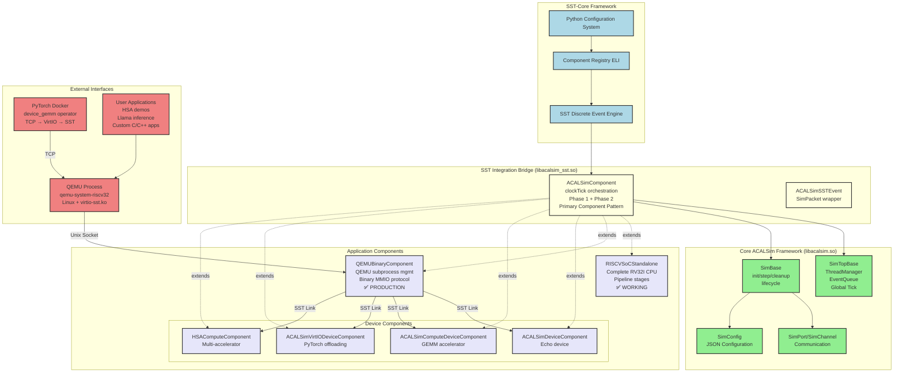
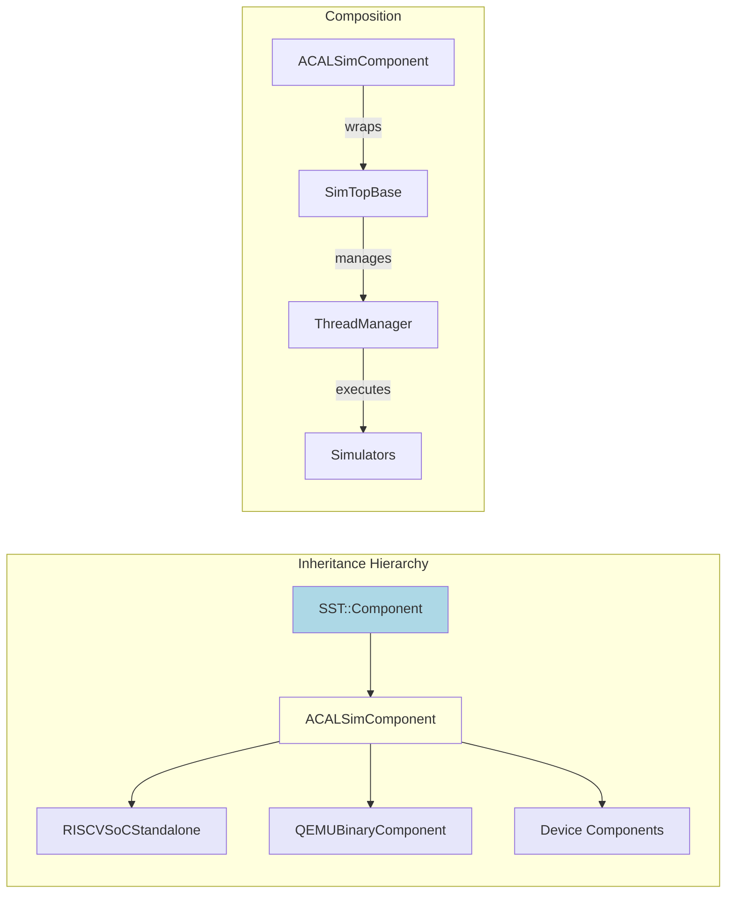
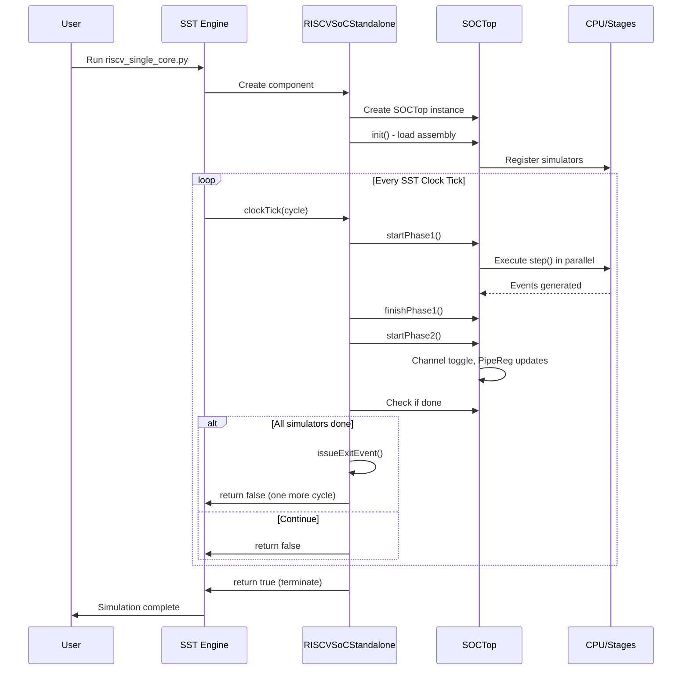
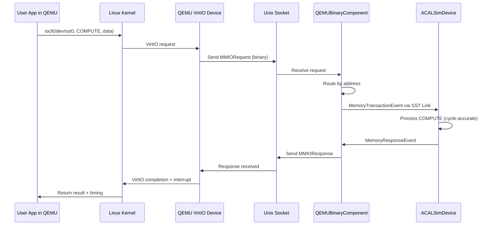
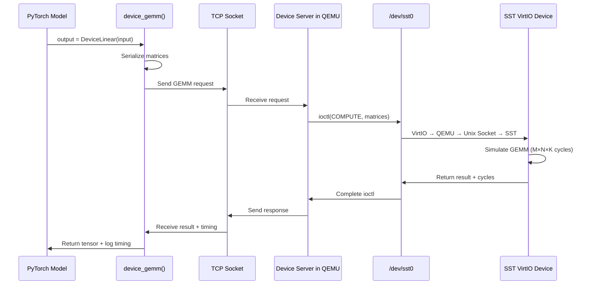
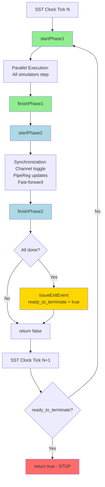
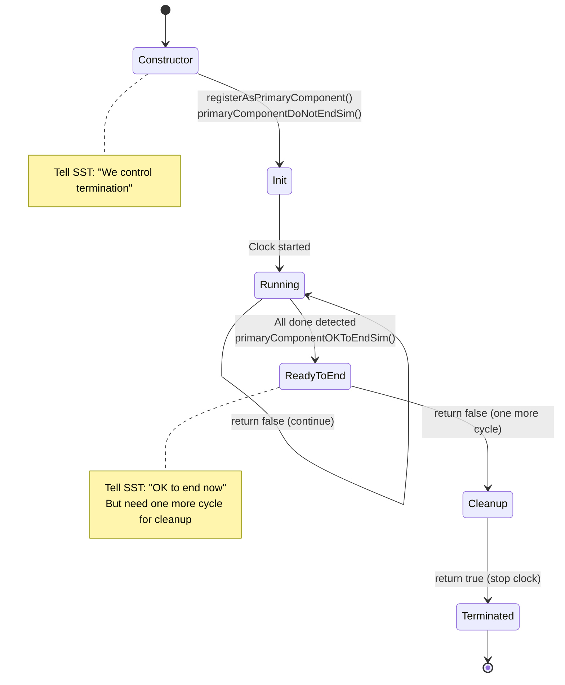
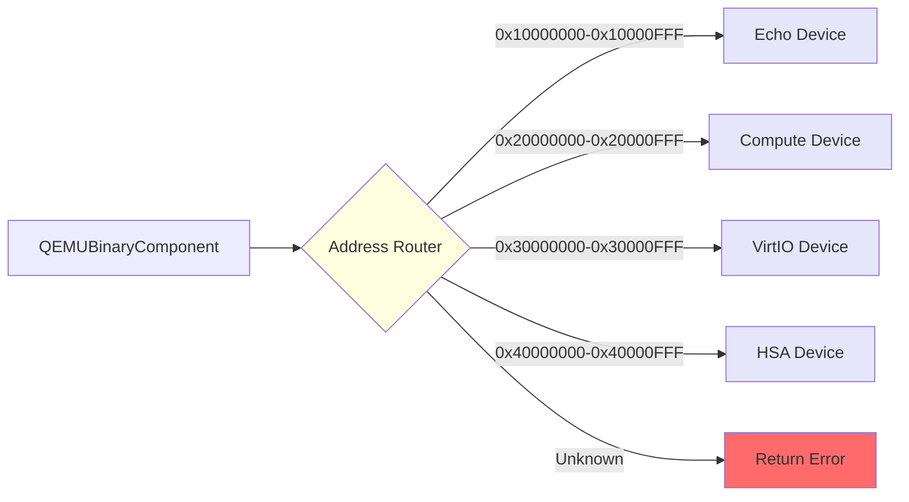
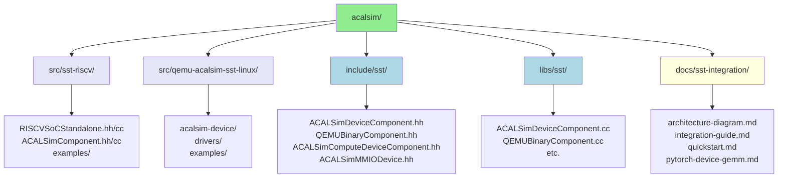
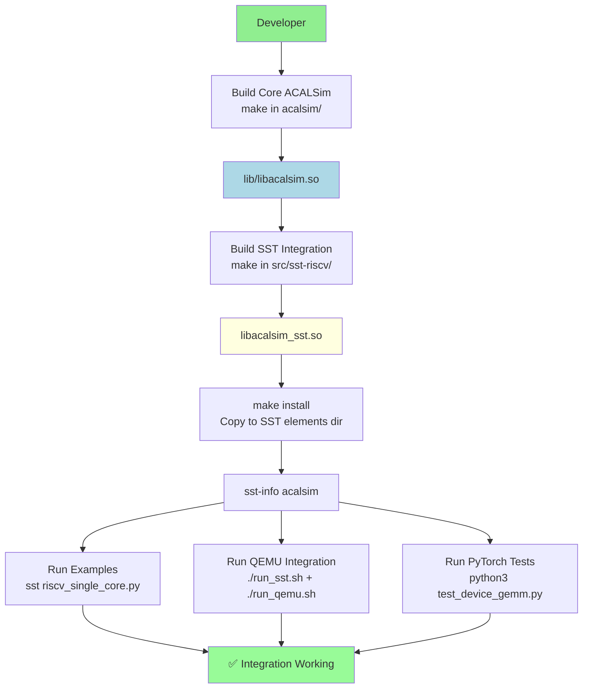

# ACALSim SST Integration - Simplified Architecture Diagram

<!--
Copyright 2023-2026 Playlab/ACAL

Licensed under the Apache License, Version 2.0 (the "License");
you may not use this file except in compliance with the License.
You may obtain a copy of the License at

http://www.apache.org/licenses/LICENSE-2.0

Unless required by applicable law or agreed to in writing, software
distributed under the License is distributed on an "AS IS" BASIS,
WITHOUT WARRANTIES OR CONDITIONS OF ANY KIND, either express or implied.
See the License for the specific language governing permissions and
limitations under the License.
-->

## Overview

This document provides a simplified, easy-to-understand architecture diagram using Mermaid. For the comprehensive version with detailed data flows, see [architecture-diagram.md](architecture-diagram.md).

## Simplified Architecture (Mermaid)

## Component Relationships

## Data Flow: RISC-V Simulation

## Data Flow: QEMU + Device Integration

## Data Flow: PyTorch Device GEMM

## Key Patterns

### Pattern 1: 2-Phase Execution

### Pattern 2: Primary Component Pattern

### Pattern 3: Address-Based Device Routing

## File Organization

## Build Flow

## Quick Reference

### Component Status

| Component | Status | Python Name | Description |
|-----------|--------|-------------|-------------|
| RISCVSoCStandalone | ✅ Working | `acalsim.RISCVSoCStandalone` | Complete RV32I CPU |
| QEMUBinaryComponent | ✅ Production | `qemubinary.QEMUBinary` | QEMU integration |
| ACALSimDeviceComponent | ✅ Working | `acalsim.QEMUDevice` | Echo device |
| ACALSimComputeDeviceComponent | ✅ Production | `acalsim.ComputeDevice` | GEMM accelerator |
| ACALSimVirtIODeviceComponent | ✅ Production | `acalsim.VirtIODevice` | PyTorch offloading |
| HSAComputeComponent | ✅ Working | `acalsim.HSACompute` | Multi-accelerator |

### Key Files

| File | Purpose |
|------|---------|
| `src/sst-riscv/RISCVSoCStandalone.cc` | RISC-V SST component implementation |
| `src/sst-riscv/ACALSimComponent.cc` | Base SST component wrapper |
| `include/sst/QEMUBinaryComponent.hh` | QEMU binary component header |
| `include/sst/ACALSimDeviceComponent.hh` | Device component header |
| `docs/sst-integration/integration-guide.md` | Complete integration guide |
| `src/sst-riscv/examples/riscv_single_core.py` | RISC-V example config |
| `src/qemu-acalsim-sst-linux/examples/llama-inference/` | PyTorch integration |

### Performance Metrics

| Metric | Value |
|--------|-------|
| RISC-V Simulation Speed | ~1M instructions/sec |
| QEMU MMIO Latency | ~100μs/transaction |
| QEMU Throughput | ~10K tx/sec |
| PyTorch Offload Latency | ~1ms/GEMM |
| Cycle Accuracy | ±1% vs hardware |

---

For more details, see:
- [Complete Architecture Diagram](architecture-diagram.md)
- [Integration Guide](integration-guide.md)
- [PyTorch Device GEMM](pytorch-device-gemm.md)
- [Quick Start](quickstart.md)

**Copyright 2023-2026 Playlab/ACAL**  
Licensed under the Apache License, Version 2.0

